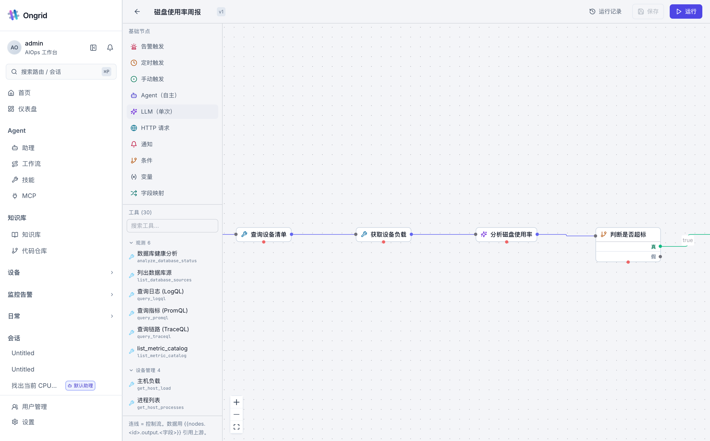
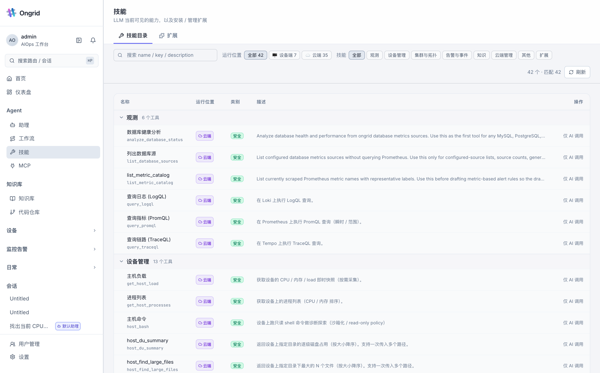
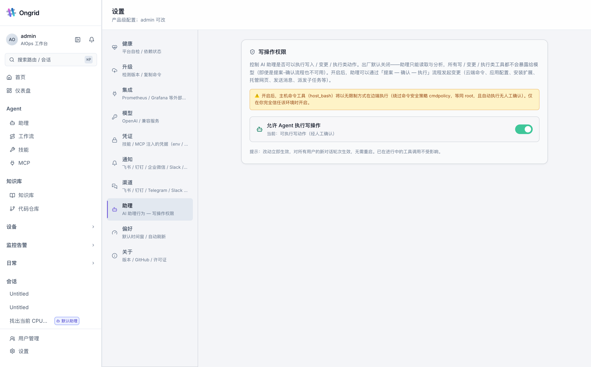
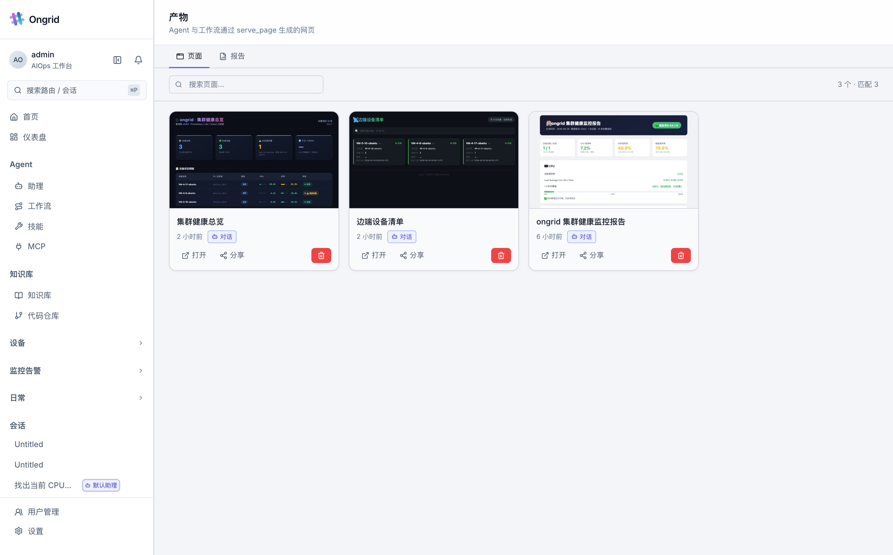

#  Ongrid

> **An AI-native SRE workspace that investigates alerts, gathers evidence, explains root cause, and moves fixes through a governed ops workflow.**

*Alerts · metrics · logs · traces · topology · host evidence · RAG knowledge · specialist agents · workflows · MCP tools · GitOps handoff.*

[](https://goreportcard.com/report/github.com/ongridio/ongrid)
[](https://github.com/ongridio/ongrid/releases/latest)
[](go.mod)
[](https://opensource.org/licenses/Apache-2.0)
[](#features)
[](CONTRIBUTING.md)
[](https://t.me/ongridai)
[](https://join.slack.com/t/ongrid-co/shared_invite/zt-400skx7hz-WU1nmF1XVYH4S3Q1NfWrbw)

English | [简体中文](./README_ZH.md) | [日本語](./README_JA.md) | [한국어](./README_KO.md) | [Español](./README_ES.md) | [Français](./README_FR.md) | [Deutsch](./README_DE.md) | [Português](./README_PT.md) | [Русский](./README_RU.md)

---

<p align="center">
  
</p>
<p align="center"><sub><a href="https://github.com/ongridio/ongrid/releases/download/v0.7.169/Area2_hq.mp4">▶ Watch full demo in HD (MP4, 18 MB)</a></sub></p>

<div align="center">

[What is Ongrid](#what-is-ongrid) • [AI in action](#ai-in-action) • [Screenshots](#screenshots) • [Docs](#documentation) • [Features](#features) • [Install](#install) • [Integrations](#integrations)

</div>

## What is Ongrid?

Ongrid is an open-source AIOps / SRE workspace for teams that operate real infrastructure.

It connects observability data, host tools, knowledge bases, workflows, and AI agents into one loop:

> **Alert → evidence collection → root-cause analysis → mitigation → fix proposal → workflow / coding-agent handoff → human review → GitOps / release → continuous observation.**

Ongrid is not just a chat bot over shell commands. It is designed around the engineering boundaries production ops needs: read/write separation, explicit approval, edge access without inbound ports, auditable tool calls, and workflows that can be reviewed before they change systems.

## Why Ongrid?

If your team already has Prometheus, Loki, Tempo, Grafana, runbooks, source repos, Slack/Lark/DingTalk, and a few scripts, the hard part is not adding another dashboard. The hard part is connecting them into an investigation and repair loop that engineers can trust at 3 a.m.

- **Evidence first** — start from metrics, logs, traces, topology, host state, changes, and historical incidents before making a claim.
- **Agent with boundaries** — agents can inspect, reason, and propose actions; write/change tools are gated by policy and human review.
- **Workflow, not one-off prompts** — successful investigations can become reusable workflows with triggers, tool nodes, conditions, notifications, and artifacts.
- **Extensible tool surface** — built-in skills cover observability and hosts; MCP brings external systems into the same toolbag.
- **Self-hostable control plane** — run it in your own environment with outbound edge agents and no inbound SSH exposure.

## AI in action

When an alert fires, Ongrid can start an investigation automatically or from chat:

1. **Collect context** — identify the affected device/service, related alerts, recent changes, and observability window.
2. **Query evidence** — run PromQL / LogQL / TraceQL, inspect host state through the edge agent, and retrieve relevant runbooks or code context.
3. **Explain the root cause** — produce a diagnosis with evidence, blast radius, confidence, and mitigation options.
4. **Propose or execute safely** — generate a workflow, approval card, report, page, IM update, or GitOps handoff depending on risk.

The target maturity is a governed loop: low-risk, well-tested actions can become policy-driven workflows; high-risk changes stay human-reviewed.

## Screenshots

| Workflow editor | Skills inventory |
|---|---|
|  |  |
| Agent write gate | Artifacts center |
|  |  |

## Features

### Agent & RCA

- 🤖 **Coordinator + specialist agents** — route work to SRE / network / database / infra experts.
- 🚨 **Alert-driven investigation** — start RCA from an alert, incident reopen, chat request, or workflow trigger.
- 🔍 **Evidence-backed root cause** — correlate metrics, logs, traces, topology, host state, and knowledge-base results.
- 🧠 **RAG for ops knowledge** — connect runbooks, incident history, architecture docs, and code repositories.
- 🧰 **Skill inventory** — expose tools with descriptions, schemas, runtime location, and risk class so agents call them predictably.

### Safe execution

- 🔒 **Zero inbound ports** — edge agents dial out; hosts do not need exposed SSH / HTTP ports.
- 💻 **Browser shell and host tools** — inspect hosts through audited reverse tunnels and read-only tools.
- ✅ **Human-in-the-loop approvals** — write/change/execute tools produce approval cards before running.
- 🛡️ **Agent write gate** — AI write capabilities are off by default and must be explicitly enabled by an admin.
- 🧾 **Audit trail** — tool calls, approvals, workflow runs, and artifacts are visible and traceable.

### Workflow & artifacts

- 🔁 **Visual workflows** — compose triggers, agents, tools, HTTP requests, conditions, notifications, and reports.
- ✨ **AI-generated workflows** — describe a remediation or report flow in natural language and turn it into editable nodes.
- 📦 **Unified tasks** — one-off and recurring jobs share the same task model, history, and artifacts.
- 📄 **Artifacts center** — generated pages and reports are private by default, with explicit sharing and TTL controls.
- 🔌 **MCP client** — register external MCP servers and expose their tools to chat agents and workflows.

### Platform

- 🐳 **Self-host in one command** — `install.sh` brings up the full stack.
- 📊 **Built-in observability stack** — Prometheus + Loki + Tempo + Grafana wired for quick start.
- 🧠 **Bring your own model** — Anthropic / OpenAI / GLM / DeepSeek / Gemini / Kimi, with hot routing.
- 💬 **Two-way IM channels** — Slack / Telegram / Lark / DingTalk / WeCom, with per-channel locale.

## What changed in v0.9.0?

v0.9.0 focuses on moving Ongrid from diagnosis toward governed automation:

- **Unified tasks** for one-off and recurring jobs.
- **MCP client** for external tool integration.
- **Agent write gate** with fail-safe default-off behavior.
- **AI workflow generation**, HTTP nodes, persona selection, variable picker, and better run errors.
- **Artifacts center** for generated pages and reports.
- **Built-in `serve_page` and `send_im_message` skills** for sharing investigation output.

See [CHANGELOG.md](CHANGELOG.md) for the full release notes.

## Documentation

The full product documentation is available at [ongrid.cloud](https://ongrid.cloud/docs/get-started/introduction).

| Area | Start here |
|---|---|
| **Get started** | [Introduction](https://ongrid.cloud/docs/get-started/introduction) · [Quickstart](https://ongrid.cloud/docs/get-started/quickstart) · [Architecture](https://ongrid.cloud/docs/get-started/architecture) · [Concepts](https://ongrid.cloud/docs/get-started/concepts) |
| **Install & operate** | [Server install](https://ongrid.cloud/docs/install/server) · [Edge install](https://ongrid.cloud/docs/install/edge) · [First boot](https://ongrid.cloud/docs/install/first-boot) · [Upgrade](https://ongrid.cloud/docs/install/upgrade) |
| **Capabilities** | [Alerts](https://ongrid.cloud/docs/capabilities/alerts) · [RCA](https://ongrid.cloud/docs/capabilities/rca) · [Monitoring](https://ongrid.cloud/docs/capabilities/monitoring) · [Logs](https://ongrid.cloud/docs/capabilities/logs) · [Traces](https://ongrid.cloud/docs/capabilities/traces) · [Knowledge](https://ongrid.cloud/docs/capabilities/knowledge) · [Skills](https://ongrid.cloud/docs/capabilities/skills) |
| **Agents** | [Overview](https://ongrid.cloud/docs/agents/overview) · [Coordinator](https://ongrid.cloud/docs/agents/coordinator) · [Incident investigator](https://ongrid.cloud/docs/agents/incident-investigator) · [Specialists](https://ongrid.cloud/docs/agents/specialists) · [Reviewer](https://ongrid.cloud/docs/agents/reviewer) |
| **Reference** | [API](https://ongrid.cloud/docs/reference/api) · [CLI](https://ongrid.cloud/docs/reference/cli) · [Alert rules](https://ongrid.cloud/docs/reference/alert-rules) · [Skill manifest](https://ongrid.cloud/docs/reference/skill-manifest) · [Data plane](https://ongrid.cloud/docs/reference/data-plane) |

## Install

Download the latest release for your server architecture (`linux-amd64` or `linux-arm64`), extract it, and run the installer (Ubuntu 22.04+, Debian 12+, RHEL/Rocky 9):

Choose the command for your server architecture:

**AMD64**
```bash
wget https://github.com/ongridio/ongrid/releases/download/v0.9.0/ongrid-v0.9.0-linux-amd64.tar.xz
tar -xf ongrid-v0.9.0-linux-amd64.tar.xz && cd ongrid-v0.9.0-linux-amd64
sudo ./install.sh
```

**ARM64**
```bash
wget https://github.com/ongridio/ongrid/releases/download/v0.9.0/ongrid-v0.9.0-linux-arm64.tar.xz
tar -xf ongrid-v0.9.0-linux-arm64.tar.xz && cd ongrid-v0.9.0-linux-arm64
sudo ./install.sh
```

**🇨🇳 Mainland China** — if GitHub is slow, use the matching CDN mirror URL instead:

```bash
# AMD64
wget https://ongrid.cloud/dl/ongrid-v0.9.0-linux-amd64.tar.xz

# ARM64
wget https://ongrid.cloud/dl/ongrid-v0.9.0-linux-arm64.tar.xz
```

## Integrations

Drop-in for the observability, channel, and model stacks your team already uses.

| | |
|---|---|
| **Observability** | &nbsp;&nbsp;&nbsp;&nbsp;&nbsp;&nbsp;&nbsp;&nbsp;&nbsp;&nbsp;&nbsp;&nbsp;&nbsp;&nbsp;&nbsp; |
| **Channels** | &nbsp;&nbsp;&nbsp;&nbsp;&nbsp;&nbsp;&nbsp;&nbsp;&nbsp;&nbsp;&nbsp;&nbsp;&nbsp;&nbsp;&nbsp; |
| **Models** | &nbsp;&nbsp;&nbsp;&nbsp;&nbsp;&nbsp;&nbsp;&nbsp;&nbsp;&nbsp;&nbsp;&nbsp;&nbsp;&nbsp;&nbsp; |

## License

Apache 2.0 — see [LICENSE](LICENSE).

## Star History

<a href="https://www.star-history.com/#ongridio/ongrid&amp;Date">
  <picture>
    <source media="(prefers-color-scheme: dark)" srcset="https://api.star-history.com/svg?repos=ongridio/ongrid&amp;type=Date&amp;theme=dark" />
    
  </picture>
</a>
