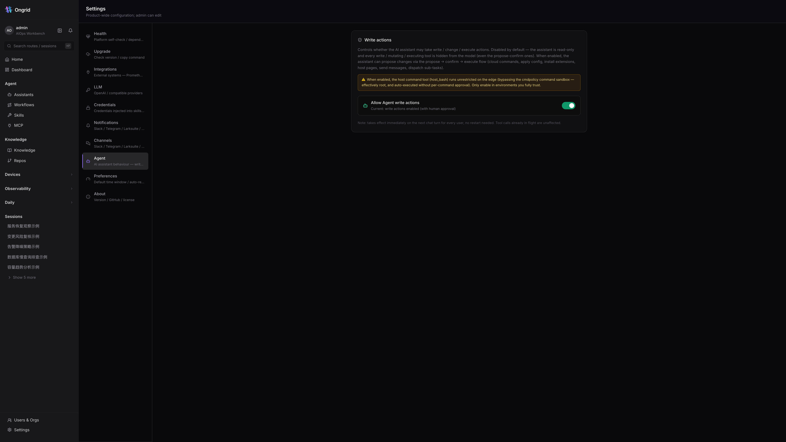
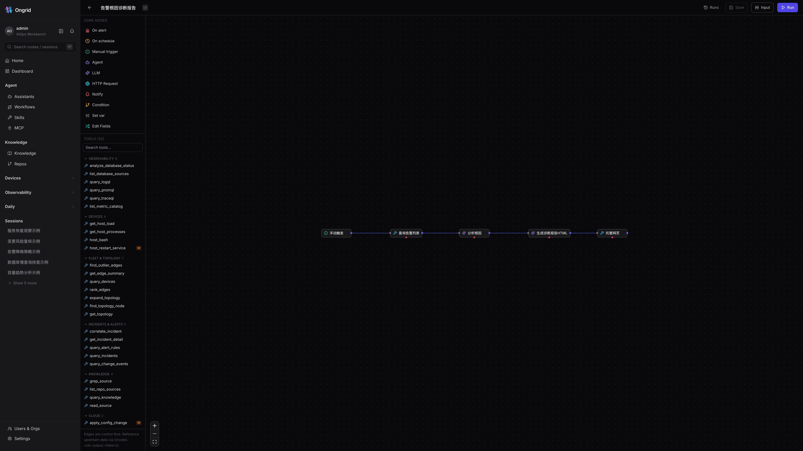
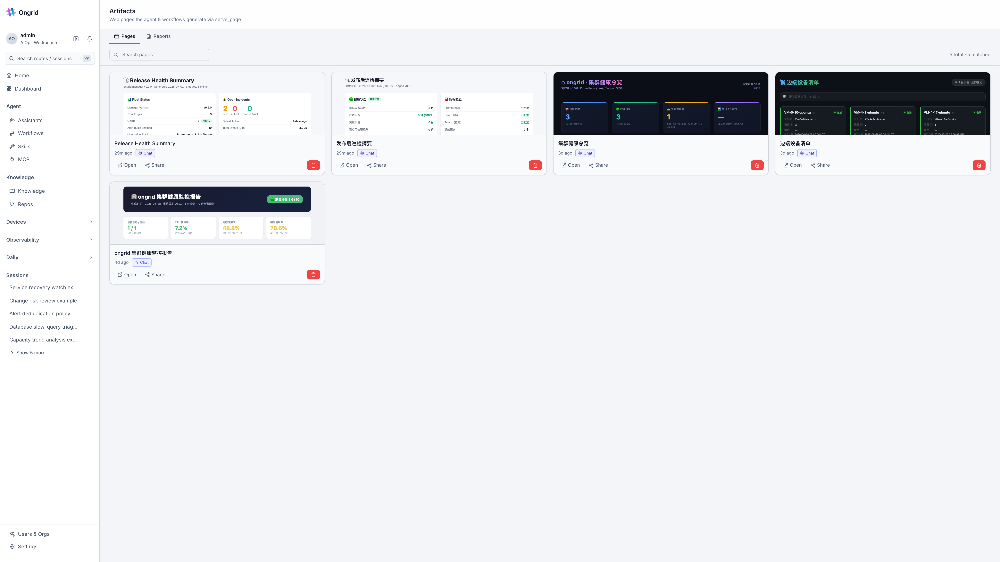
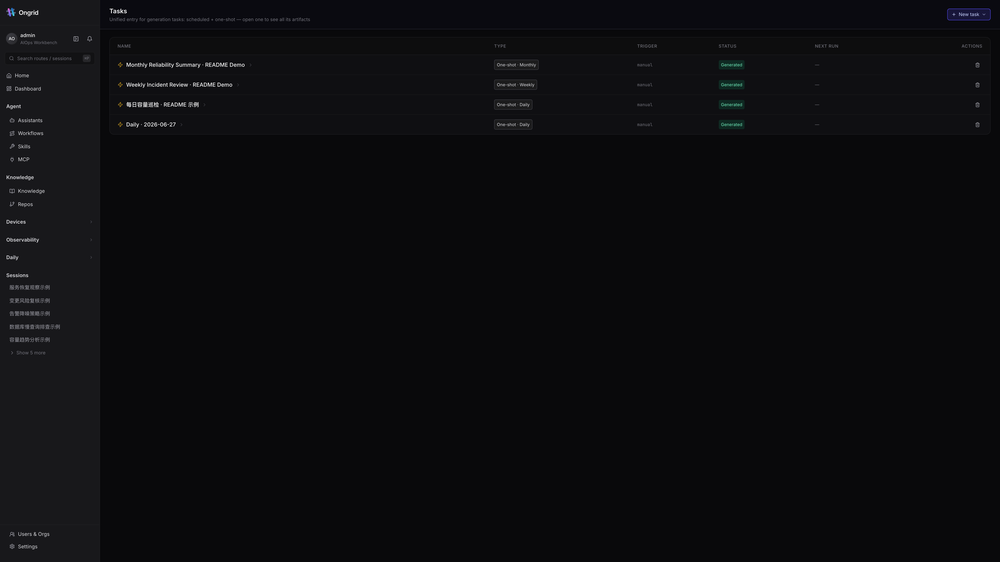

#  Ongrid

> **An AI-native SRE workspace that investigates incidents, explains blast radius, and moves approved fixes through governed operations workflows.**

Ongrid connects alerts, metrics, logs, traces, topology, host evidence, runbooks, source code, workflows, and approval gates into one operations loop. It is built for teams that self-host critical infrastructure and want AI assistance without giving up control, auditability, or network boundaries.

[](https://goreportcard.com/report/github.com/ongridio/ongrid)
[](https://github.com/ongridio/ongrid/releases/latest)
[](go.mod)
[](https://opensource.org/licenses/Apache-2.0)
[](#features)
[](CONTRIBUTING.md)
[](https://t.me/ongridai)
[](https://join.slack.com/t/ongrid-co/shared_invite/zt-400skx7hz-WU1nmF1XVYH4S3Q1NfWrbw)

---

<p align="center">
  
</p>
<p align="center"><sub><a href="https://github.com/ongridio/ongrid/releases/download/v0.7.169/Area2_hq.mp4">Watch full demo in HD (MP4, 18 MB)</a></sub></p>

<div align="center">

[Why Ongrid](#why-ongrid) - [Product Tour](#product-tour) - [In Action](#in-action) - [What Ongrid Covers](#what-ongrid-covers) - [Integrations](#integrations) - [Install](#install) - [Docs](#documentation)

</div>

## Why Ongrid

Ongrid is an open-source AIOps / SRE workspace for teams operating real infrastructure.

It turns noisy operational signals into a governed investigation and repair loop:

```text
Alert or question
  -> collect evidence from observability, topology, hosts, changes, docs, and code
  -> explain root cause, blast radius, and confidence
  -> draft a workflow, report, page, chat update, or remediation proposal
  -> require approval for risky actions
  -> audit every tool call and execution result
```

Ongrid is not a thin chat wrapper over shell commands. It is designed around production boundaries: read/write separation, explicit approval, edge access without inbound ports, auditable tool calls, and workflows that can be reviewed before they change systems.

## Product Tour

Ongrid is organized around the real SRE operating loop: investigate, gather context, use governed tools, approve risky changes, automate repeatable work, and keep durable outputs for handoff and review.

### 1. Investigate With Context

Start from an alert or an operator question. Ongrid pulls together metrics, logs, traces, topology, host state, recent changes, runbooks, and source code before it explains what is happening.

- Evidence-backed RCA instead of generic chat answers.
- Specialist agents for SRE, network, disk, compute, database, and operations.
- Root cause, confidence, blast radius, and next actions in one workspace.

> Screenshot slot: investigation workspace / incident room

### 2. Bring Your Knowledge Base Into Every RCA

Runbooks, incident history, architecture notes, and repositories become searchable context for both humans and agents. Operators can inspect the same source material the agent used.

- Git repository sync over HTTPS or SSH deploy keys.
- Path and tag filters for runbooks, services, and domains.
- Search-first answers grounded in internal documents.

> Screenshot slot: knowledge vault / knowledge repositories

### 3. Make Tools Visible and Governed

Every tool the agent can call is visible in the Skills catalog or MCP server inventory. Operators can see where a tool runs, what risk class it has, and whether it requires approval.

- Built-in host, network, observability, artifact, and messaging skills.
- Safe, mutating, and dangerous risk classes.
- External MCP tools from Grafana, Kubernetes, PagerDuty, GitHub, databases, Terraform, or internal platforms.

> Screenshot slot: skills catalog and MCP servers

### 4. Approve Production Changes Before They Run

Ongrid separates reasoning from execution. Agents can propose a restart, config change, command, or remediation step, but humans decide what actually runs.

- Scoped proposals with affected resources.
- Dry-run context, rollback notes, and reviewer controls.
- Approve / reject history attached to the operational record.

<p align="center">
  
</p>

### 5. Turn Good Incident Handling Into Workflows

Successful investigations can become repeatable workflows with triggers, agent nodes, tool nodes, HTTP calls, conditions, notifications, and generated artifacts.

- Alert, manual, and scheduled triggers.
- AI-generated workflows that remain editable.
- Unified task history for one-off jobs and recurring reports.

<p align="center">
  
</p>

### 6. Keep Durable Operational Artifacts

Generated pages and reports are private by default, shareable only when operators decide, and useful for handoff, retrospectives, customer updates, and daily briefs.

- RCA pages, operations reports, and investigation summaries.
- Explicit sharing and TTL controls.
- Artifacts tied back to tasks, workflows, and incidents.

<p align="center">
  
</p>

### 7. Run One-off and Recurring Operations From One Place

Scheduled reports, one-off investigations, and generated outputs share the same task surface. Operators can see what generated each report, when it runs next, and which artifacts are ready to review.

- One-off jobs and recurring schedules in the same view.
- Output history tied to reports and generated pages.
- Clear next-run and status information for handoff.

<p align="center">
  
</p>

### 8. Operate Your Fleet Without Opening Inbound SSH

Edge agents dial out, so operators can inspect hosts and services without exposing SSH, opening inbound ports, or distributing private keys.

- Edge inventory and device health.
- Browser shell and read-only host tools.
- Process, journal, filesystem, DNS, TCP, and HTTP diagnostics.

> Screenshot slot: fleet control / device detail

## In Action

### Incident response with an approval boundary

```text
Alert: checkout-api p99 latency is above SLO.
Ongrid: checks Prometheus, Loki, Tempo, topology, recent changes, runbooks, code, and host state.
Finding: db-read-1 has IO saturation after a backup job; checkout-api waits on read replicas.
Proposal: pause the backup job for 30 minutes and restart one unhealthy worker.
Gate: operator approves or rejects the proposal before anything mutating runs.
Output: RCA page, evidence links, approval history, rollback note, and customer update draft.
```

### Daily operations brief

```text
Trigger: every weekday at 09:00.
Flow: collect fleet health, top alerts, slow traces, noisy hosts, open approvals, and recent changes.
Output: a private report page for handoff, with share controls and TTL.
```

### Remote diagnostics without inbound SSH

```text
Ask: Inspect nginx memory, open files, and recent kernel messages on edge-03.
Ongrid: runs approved read-only host tools through the outbound edge tunnel.
Output: audited command results in the browser and attached to the incident timeline.
```

## What Ongrid Covers

| Layer | Capabilities |
|---|---|
| **Investigation** | Alerts, RCA, specialist agents, evidence collection, confidence, blast radius, and next actions. |
| **Knowledge** | Runbooks, incident history, architecture notes, repositories, semantic search, path filters, and tags. |
| **Tools** | Built-in skills, MCP servers, host diagnostics, observability queries, hosted pages, and IM delivery. |
| **Governance** | Approval gate, risk classes, dry-run context, rollback notes, reviewer controls, and audit trail. |
| **Automation** | Visual workflows, AI-generated flows, manual triggers, alert triggers, schedules, and unified tasks. |
| **Artifacts** | RCA pages, daily reports, investigation summaries, share links, TTL controls, and task output history. |
| **Platform** | Self-hosted manager, outbound edge agents, browser shell, built-in observability, and BYO model providers. |

## What Changed in v0.9.0?

v0.9.0 moves Ongrid from diagnosis toward governed automation:

- **Unified tasks** for one-off and recurring jobs.
- **MCP client** for external tool integration.
- **Agent write gate** with fail-safe default-off behavior.
- **AI workflow generation**, HTTP nodes, persona selection, variable picker, and better run errors.
- **Artifacts center** for generated pages and reports.
- **Built-in `serve_page` and `send_im_message` skills** for sharing investigation output.

See [CHANGELOG.md](CHANGELOG.md) for the full release notes.

## Install

Download the latest release for your server architecture (`linux-amd64` or `linux-arm64`), extract it, and run the installer (Ubuntu 22.04+, Debian 12+, RHEL/Rocky 9):

**AMD64**

```bash
wget https://github.com/ongridio/ongrid/releases/download/v0.9.0/ongrid-v0.9.0-linux-amd64.tar.xz
tar -xf ongrid-v0.9.0-linux-amd64.tar.xz && cd ongrid-v0.9.0-linux-amd64
sudo ./install.sh
```

**ARM64**

```bash
wget https://github.com/ongridio/ongrid/releases/download/v0.9.0/ongrid-v0.9.0-linux-arm64.tar.xz
tar -xf ongrid-v0.9.0-linux-arm64.tar.xz && cd ongrid-v0.9.0-linux-arm64
sudo ./install.sh
```

If GitHub downloads are slow, use the matching CDN mirror URL instead:

```bash
# AMD64
wget https://ongrid.cloud/dl/ongrid-v0.9.0-linux-amd64.tar.xz

# ARM64
wget https://ongrid.cloud/dl/ongrid-v0.9.0-linux-arm64.tar.xz
```

## Integrations

Ongrid connects to the observability, chat, and model stacks your team already uses.

| | |
|---|---|
| **Observability** | &nbsp;&nbsp;&nbsp;&nbsp;&nbsp;&nbsp;&nbsp;&nbsp;&nbsp;&nbsp;&nbsp;&nbsp;&nbsp;&nbsp;&nbsp; |
| **Channels** | &nbsp;&nbsp;&nbsp;&nbsp;&nbsp;&nbsp;&nbsp;&nbsp;&nbsp;&nbsp;&nbsp;&nbsp;&nbsp;&nbsp;&nbsp; |
| **Models** | &nbsp;&nbsp;&nbsp;&nbsp;&nbsp;&nbsp;&nbsp;&nbsp;&nbsp;&nbsp;&nbsp;&nbsp;&nbsp;&nbsp;&nbsp; |

## Documentation

The full product documentation is available at [ongrid.cloud](https://ongrid.cloud/docs/get-started/introduction). This branch also includes website-ready product copy in [docs/product-showcase.md](docs/product-showcase.md) and workflow copy in [docs/workflow-catalog.md](docs/workflow-catalog.md).

| Area | Start here |
|---|---|
| **Get started** | [Introduction](https://ongrid.cloud/docs/get-started/introduction) - [Quickstart](https://ongrid.cloud/docs/get-started/quickstart) - [Architecture](https://ongrid.cloud/docs/get-started/architecture) - [Concepts](https://ongrid.cloud/docs/get-started/concepts) |
| **Install and operate** | [Server install](https://ongrid.cloud/docs/install/server) - [Edge install](https://ongrid.cloud/docs/install/edge) - [First boot](https://ongrid.cloud/docs/install/first-boot) - [Upgrade](https://ongrid.cloud/docs/install/upgrade) |
| **Capabilities** | [Alerts](https://ongrid.cloud/docs/capabilities/alerts) - [RCA](https://ongrid.cloud/docs/capabilities/rca) - [Monitoring](https://ongrid.cloud/docs/capabilities/monitoring) - [Logs](https://ongrid.cloud/docs/capabilities/logs) - [Traces](https://ongrid.cloud/docs/capabilities/traces) - [Knowledge](https://ongrid.cloud/docs/capabilities/knowledge) - [Skills](https://ongrid.cloud/docs/capabilities/skills) |
| **Agents** | [Overview](https://ongrid.cloud/docs/agents/overview) - [Coordinator](https://ongrid.cloud/docs/agents/coordinator) - [Incident investigator](https://ongrid.cloud/docs/agents/incident-investigator) - [Specialists](https://ongrid.cloud/docs/agents/specialists) - [Reviewer](https://ongrid.cloud/docs/agents/reviewer) |
| **Reference** | [API](https://ongrid.cloud/docs/reference/api) - [CLI](https://ongrid.cloud/docs/reference/cli) - [Alert rules](https://ongrid.cloud/docs/reference/alert-rules) - [Skill manifest](https://ongrid.cloud/docs/reference/skill-manifest) - [Data plane](https://ongrid.cloud/docs/reference/data-plane) |

## Project Map

| Area | Path |
|---|---|
| Manager and edge binaries | [`cmd/`](cmd/) |
| Go backend domains | [`internal/`](internal/) |
| React control plane | [`web/`](web/) |
| API contracts | [`api/`](api/) |
| Deployment assets | [`deploy/`](deploy/) |
| Built-in agent skills | [`skills/`](skills/) |
| Specialist agent prompts | [`agents/`](agents/) |

## Contributors

Thanks to everyone helping build Ongrid.

<a href="https://github.com/ongridio/ongrid/graphs/contributors">
  
</a>

## License

Apache 2.0 - see [LICENSE](LICENSE).

## Star History

<a href="https://www.star-history.com/#ongridio/ongrid&amp;Date">
  <picture>
    <source media="(prefers-color-scheme: dark)" srcset="https://api.star-history.com/svg?repos=ongridio/ongrid&amp;type=Date&amp;theme=dark" />
    
  </picture>
</a>
