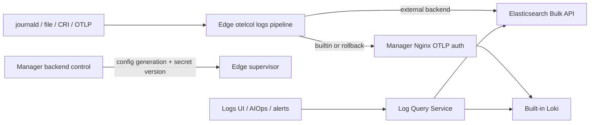

# HLD-001：日志采集、存储与查询解耦

- 状态：已批准
- 日期：2026-08-18
- 作者：Codex
- 关联 PRD：[PRD-004：外部 Elasticsearch 日志中心](../requirements/PRD-004-elasticsearch-log-center.md)
- 关联 RFC：[RFC-003：OTel 日志采集与 Elasticsearch 直写](../rfc/RFC-003-otel-elasticsearch-logs.md)
- 关联 ADR：[ADR-031：Edge 直写外部 Elasticsearch](../adr/ADR-031-edge-direct-elasticsearch-logs.md)

## 系统边界

本功能不新增独立服务。Manager 内新增 logs backend/query 模块，Edge 保留 `logs` 插件但改用 OTel Collector。外部 Elasticsearch 是客户管理的依赖，内置 Loki 保留。

## 组件与职责

| 组件 | 职责 | 不负责 |
| --- | --- | --- |
| Logs Backend Manager | 配置、凭证引用、generation、激活与回滚 | 日志正文转发 |
| Edge logs plugin | 渲染 OTel 配置、管理 checkpoint/queue、启动子进程 | 查询、保存 ES 管理凭证 |
| Plugin Secret RPC | 单向投递受限插件密钥、版本和 ACK | 任意路径写文件 |
| Log Query Service | 校验查询 AST、规划后端、归并统一结果 | 暴露原始 ES DSL |
| Loki Adapter | 编译结构化请求为 LogQL/label API | 新日志写入决策 |
| Elasticsearch Adapter | PIT/search_after、聚合、字段映射 | ES 生命周期和备份 |
| Logs UI | VKE 风格筛选、搜索、直方图、上下文 | 后端 DSL 拼接 |

## 数据流



## 模块结构

```text
api/manager/logs/v1/             日志查询与后端管理协议
internal/manager/model/logs/     后端和 assignment 持久化模型
internal/manager/data/logs/      GORM repository/migration
internal/manager/biz/logs/       配置、激活、查询规划和接口定义
internal/manager/server/logs/    HTTP handler
internal/pkg/logquery/           后端无关请求/结果与适配器公共类型
internal/edgeagent/plugins/logs/ OTel renderer、密钥、健康状态
```

接口在消费方定义：`biz/logs` 定义 repository、secret resolver、Edge dispatcher 和 backend adapter；data/server 只实现这些接口。`internal/pkg/logquery` 不依赖业务包。

## 配置和密钥时序

1. 管理员保存 DRAFT 后端；表单直接接收只写的 encoded API Key。Manager 在同一次请求内将直接 Key 加密写入 secret vault，并仅把托管引用及非敏感配置写入 `log_backends`；读取接口从不返回 Key，空 Key 表示保留已有引用。历史版本保存的外部凭证引用、自定义 CA 和 Kibana URL 继续由后端兼容，但不再暴露在默认设置页。
2. Manager 使用仅保存在控制面的 query Key（cluster monitor + 产品 data stream 的 read/view_index_metadata）逐个校验 query/write endpoint 版本和查询权限；再通过 `_has_privileges` 校验 Edge write Key 仅具有产品 data stream 的 auto_configure/create_doc。
3. 管理员选择 canary Edge；Manager 下发候选 generation 和固定 secret slot，Edge 通过认证 tunnel 按 generation 拉取写 Key并校验 SHA-256 后原子落盘。
4. Edge 渲染临时 OTel 配置，执行配置校验，成功后原子替换并重启。
5. 灰度配置创建两个 Edge 本地 pipeline：当前权威后端继续接收全量日志，候选 ES 接收影子副本；两条链路都不经过 Manager Go。
6. 候选 exporter 使用 generation 稳定 ID 和独立持久队列，且队列饱和不得阻塞权威 exporter；Edge 写入唯一 probe id，Manager 从查询 endpoint 搜索。
7. 全量切换由 Manager 枚举所有启用 logs 的 Edge；任何一台离线都会阻止全局切换。全部在线且 probe 成功后才记录全局 `cutover_at`、停止影子写并把候选设为权威。
8. ES→Loki 回滚使用同一机制反向预热：ES 继续作为权威，Loki 是非阻塞候选；全部 Loki 实写探针通过后才记录 ES 的 `ended_at`。失败时保持 ES 时间线，不制造查询盲区。
9. API Key 与 CA 使用 generation 级文件名，外部 ES 版本回退不会被本地单调检查误拒绝。

## 查询模型

请求只包含时间范围、稳定 scope、关键字策略、允许字段 filter、排序、limit 和 cursor。逻辑字段通过 registry 映射：

| 逻辑字段 | Loki | Elasticsearch OTel mapping |
| --- | --- | --- |
| `device_id` | `device_id` label | `resource.attributes.device_id` |
| `cluster_id` | `cluster_id` label | `resource.attributes.cluster_id` |
| `cluster_name` | `cluster_name` label/metadata | `resource.attributes.cluster_name` |
| `level` | `level` label | `resource.attributes.level` |
| `service_name` | `service_name` label/metadata | `resource.attributes.service_name` 稳定别名 |
| `namespace` | `namespace` label/metadata | `resource.attributes.namespace` 稳定别名 |
| `pod` / `container` / `node` | structured metadata | Node CRI 路径解析后的 `resource.attributes.*` 稳定别名 |
| `workload` | structured metadata | 仅在控制面或 Telemetry Gateway 中央元数据补全可用时提供 |
| `filename` / `unit` | structured metadata | `resource.attributes.filename` / `unit` |
| `message` | log line | `body.text` |

日志中心始终只查询当前权威后端，Loki 与 Elasticsearch 不做联邦归并。灰度阶段 Edge 同时向权威后端和候选写入，因此不会把候选重复数据返回给用户；全部真实写探针通过后，Edge 写入和 Manager 查询在同一全局切换点一起变更。旧后端数据继续保留在原存储中，但不会自动查询或迁移。结果统一为带 timestamp、message、level、scope 和 attributes 的 LogRecord；内部 `backend` 标记仅供查询规划与诊断使用，不作为逐条日志的用户可选字段。

## 数据存储

- Manager MySQL/SQLite 仅保存控制状态，不保存日志正文。
- ES 使用 `logs-ongrid.<dataset>.otel-<namespace>` data stream。
- dataset 只允许产品枚举/安全 slug，不允许包含 device/pod/file path。
- 结构化字段进入 `attributes.*`，受 allowlist、深度和字段数限制。
- 外部 ES 的 ILM、容量、快照由客户负责，激活前必须检查匹配 template。

## 安全

- 管理 API 仅管理员可写；查询沿用已认证 SPA 权限。
- 写、读 API Key 分离；Edge 无读取日志权限，Manager 无写入依赖。
- secret 不进入普通 plugin spec、URL、argv、环境变量、状态 API 或日志。
- Edge secret handler 只识别 `logs/elasticsearch_api_key` 固定 slot，拒绝路径、符号链接和旧 generation。
- 查询字段和 data stream pattern 服务端固定，不允许用户指定任意 index。
- Node logs Collector 不访问 Kubernetes API；CRI parser 提取 namespace、Pod、container 和 node。集群级 Pod/workload RBAC 仅属于 Controller/Telemetry Gateway。

## 可用性和回滚

- `logs` 插件始终使用 OTel；`backend=builtin_loki|external_elasticsearch` 只切换 exporter，不切换采集引擎。
- 灰度是有界影子双写，不改变权威查询后端；支持 Loki→ES 和 ES generation→ES generation。
- 全量切换与 ES→Loki 回滚都要求所有启用 logs 的 Edge 在线；离线 Edge 不会被静默排除。
- 回滚先双写并验证 Loki，再关闭 ES 时间线；`ended_at` 与真实数据路径一致。
- 后端切换不删除 checkpoint，失败回滚到上一 exporter。
- Promtail 已从制品、安装、升级、systemd 和卸载链路删除；紧急回退需回到上一个 Ongrid 发布版本。
- Manager/Edge 版本不兼容时保持上一可用配置并展示 pending，不做部分写入。

## 可观测性

- Edge 上报 accepted/refused、sent/failed、queue、storage、generation、last success 和 error class。
- Manager 上报查询 latency/error、rollout 状态、probe age 和无日志异常。
- endpoint、API Key、错误正文和日志正文不得作为 Prometheus label。

## 上线 Checklist

- [x] API proto、兼容版本门禁、权限模型与自动化测试完成。
- [x] 数据模型和可回滚 migration 完成。
- [x] 写/读 secret 分离、专用下发通道、SHA-256 校验和轮换语义完成。
- [x] canary、对称回滚和单一当前后端 query planner 的自动化测试完成。
- [ ] 在真实 Linux AMD64/ARM64 上完成 journald、文件日志和 Kubernetes CRI 矩阵。
- [ ] 完成 Edge→客户 Elasticsearch 的真实网络、TLS、API Key 和抓包验收。
- [ ] 完成 SLO、告警、Runbook、容量以及 30 分钟断网/队列故障注入。
- [ ] 完成 Logs/Integrations 页面视觉验收和 CODEOWNERS 覆盖。
