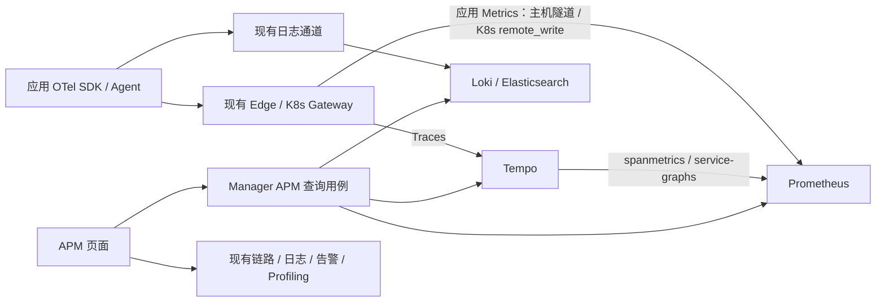

# HLD-002: 应用性能监控

状态：已确认；关联 [PRD-006](../requirements/PRD-006-application-performance-monitoring.md)、[ADR-033](../adr/ADR-033-application-performance-monitoring.md)。

## 数据流与模块

Manager Handler 完成认证与参数解析，APM 业务用例通过消费方定义的窄查询接口复用 `promquery`、`tracequery`；不新增存储层或把数据库调用放在 Handler。API 定义先写入 `api/manager/apm/v1/apm.proto`。

## 查询契约

- 时间范围必填且最多七天，趋势点数与列表数量有上限，后端调用设置超时。
- 省略 environment/namespace 表示全部，显式空字符串表示未设置；服务详情要求完整身份。
- 服务列表按窗口聚合请求率、错误率和延迟桶，默认 `metric_source=application_metrics`，`protocol=http|rpc`，`metric_format=otel|legacy`。当前/旧版、HTTP/RPC 分别查询，禁止重复相加或静默回退。接口按 HTTP 方法/路由或 RPC 完整方法名聚合，响应沿用 operation 字段。Trace 样本模式的 SERVER 与 CONSUMER 分开。
- 有观测但没有错误序列时补 0；无请求时错误率/延迟为 null；Prometheus 非有限值不进入 JSON 数值。
- 部署配置保留既有 service.name 兼容维度，新增 service.namespace、deployment.environment.name；旧环境字段在受控 Collector 规范化。
- 依赖节点使用 client/server 各自的 namespace/environment，不以名称唯一化，不持久化成业务拓扑关系。
- 诊断只使用有限数量真实样本，返回“已观察/未观察/未知/查询失败”，不以样本缺失断言应用配置错误。
- 应用指标模式从所选时间、服务身份、协议与指标格式的请求计数序列发现实例，再与 Trace 样本实例去重合并。Trace 采样为零仍可显示指标中的实例；未导出身份或完全未接入的实例仍需与部署清单核对。

## 产品联动与告警

服务列表 `/apm`、详情 `/apm/service` 使用 URL 保存完整身份与绝对时间。Trace 查询沿用现有 API 和瀑布图；日志页面读取 trace_id、service、environment、namespace、start/end 参数并进入统一日志查询。Profile 复用现有端点采集工具，按需选择关联实例，不默认采集任意进程。

APM 告警模板由后端使用与页面相同的查询构造生成，仅接受应用指标，明确协议/格式、最小请求量和持续窗口，用户在现有规则编辑器预览/保存。模板不自动启用业务告警，不改变已有 Trace 规则。

通知沿用现有渠道解析和发送器，仅透传事件中的应用身份标签；规则、事件和设备控制标签仍由告警系统生成，不能被指标标签覆盖。

## 安全、兼容与验证

受现有登录保护，禁止客户端指定后端地址；PromQL 与 TraceQL 的值正确转义。采集配置补齐属性时不把网关身份误作应用实例。敏感值不进入指标标签。APM 沿用平台级访问边界。

单元测试验证查询语义和边界，真实固定版本 Tempo/Prometheus 样本验证统计与标签；前端验证导航、缺数状态和关联。回滚新增版本/配置，无数据迁移和遥测删除。容量、HA、持续采集按实际试点结果另行演进。
