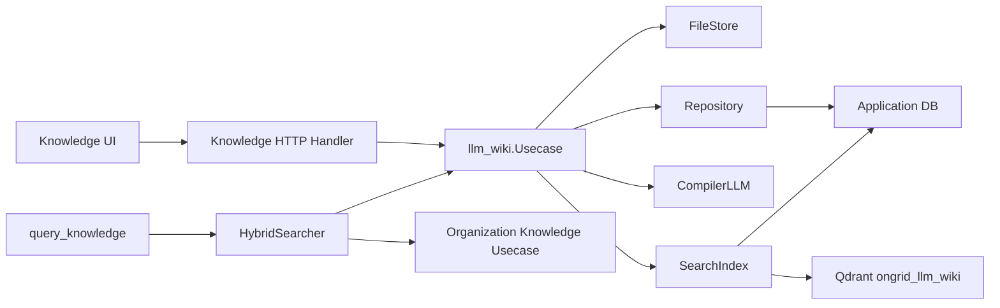
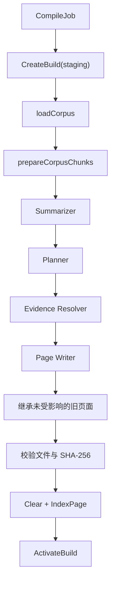

# HLD-002：LLM Wiki 可审计知识编译层

- 状态：已批准
- 日期：2026-09-10
- 实现入口：`internal/manager/biz/knowledge/llm_wiki/`
- HTTP 入口：`internal/manager/server/knowledge/llmwiki_http.go`
- 数据入口：`internal/manager/data/knowledge/llm_wiki/`
- 关联 ADR：[ADR-033：LLM Wiki 架构](../adr/ADR-033-llm-wiki-architecture.md)
- 关联 RFC：[RFC-004：LLM Wiki 编译、存储与检索实现](../rfc/RFC-004-llm-wiki.md)

## 1. 范围

LLM Wiki 是 Manager 进程内的知识编译模块，不是独立服务。当前代码提供：

- 将组织知识库中的 `manual`、`upload`、`repo` 文档同步为 Wiki Raw 来源。
- 将 Raw 内容切块、摘要、规划为生成页面并写入不可变 build。
- 通过 active build 提供 Raw 与生成页文件树、详情读取和 PDF/DOCX Raw 预览。
- 通过应用数据库词法索引和 Qdrant 页级向量索引提供 Wiki 检索。
- 将 Wiki 检索与旧组织知识库组合为 `hybrid`、`wiki`、`rag` 三种模式。
- 提供编译任务创建、查询、取消和重试 HTTP API。

当前代码不包含独立队列消费者、Topic/Evidence 表、Canonical Topic 页面、staging manifest、Schema HTTP API、单独上传 Wiki API 或单独 build 查询 API。

## 2. 系统边界



| 层 | 位置 | 当前职责 |
| --- | --- | --- |
| Server | `internal/manager/server/knowledge/llmwiki_http.go` | 注册 HTTP 路由、解析参数、组织知识库同步输入、统一响应和错误映射 |
| Service | `internal/manager/service/knowledge/hybrid_search.go`、`llmwiki_usage.go` | Raw/Wiki 混合检索、内部 Token usage session 适配 |
| Biz | `internal/manager/biz/knowledge/llm_wiki/` | Source 镜像、编译管线、页面写入、发布、文件树、删除、检索编排 |
| Data | `internal/manager/data/knowledge/llm_wiki/` | 应用数据库仓储、词法索引、Qdrant 向量索引 |
| Model | `internal/manager/model/knowledge/llm_wiki/` | Source、Version、CompileJob、Build、BuildPage、Lexical |
| Files | `ONGRID_LLM_WIKI_DIR` | Raw 文件、不可变版本快照、生成页面 artifact |

## 3. 配置与启动

| 环境变量 | 代码默认值 | 当前行为 |
| --- | --- | --- |
| `ONGRID_LLM_WIKI_ENABLED` | `false` | 为 `false` 时不创建 Wiki Usecase，不注册 Wiki HTTP 路由，不启用混合检索 Wiki 分支 |
| `ONGRID_LLM_WIKI_DIR` | `/var/lib/ongrid/llm-wiki` | FileStore 根目录 |
| `ONGRID_LLM_WIKI_TIMEOUT_SECONDS` | `600` | 后台编译任务超时；任务租约为其加 1 分钟 |

Compose 示例将 `ONGRID_LLM_WIKI_ENABLED` 默认设为 `true`，代码默认仍为 `false`。

启动流程：

1. `NewFileStore` 解析根目录，`Ensure` 删除非当前布局目录/文件并创建 `raw/`、`wiki/builds/`、`.llm-wiki/versions/`。
2. `llmwikidata.Open` 在应用数据库上创建 Repository 和 SearchIndex。
3. embedder 已配置时，`index.New` 必须成功连接 Qdrant、确保 `ongrid_llm_wiki` collection 和 `tenant_id` keyword payload index，否则 Wiki 初始化失败。
4. `Usecase.New` 执行 `Reconcile`，从版本快照恢复缺失 Raw 文件。单个 Source 的 `current_version_id` 指向的行不存在、或快照不可读时，只把该 Source 标记为 `failed` 并跳过：初始化失败会导致 `llmWikiUC` 为 nil，所有 `llm-wiki` 路由都不会注册，前端只能看到 404，也就无法通过重新同步修复它。
5. 若索引支持 `HasVectors` 且当前租户无向量，尝试从 active build 回填索引。回填失败只记录 warning。

## 4. 来源同步与版本

### 4.1 来源创建

当前生产入口只有 `POST /v1/knowledge/llm-wiki/sync`：

1. Handler 分别完整分页读取组织知识库的 `manual`、`upload` 和 `repo` 文档；任一类型读取失败时中止，不提交不完整的来源集合。
2. 每个文档转换为 `OrganizationSource{ID, Title, Path, Content}`。
3. `SyncOrganizationSources` 使用 `SourceKey = "organization:<doc.ID>"`。
4. Raw 相对路径为 `doc.Path/<doc.Title>.md`；路径经过安全清理但保留 Unicode。
5. 文件名缺失时使用 `document-<id>`。
6. 内容写入 Raw 文件，并写入内容寻址快照 `.llm-wiki/versions/<source-hash>/<sha256>.md`。
7. 同步是非破坏性的增量刷新：只新增或更新本次快照中出现的 Source，不删除缺失项。代码仓库重新索引时会先清空再回填 Qdrant，缺失可能只是短暂状态；而删除任一 Source 会使整个 active build 失效，因此同步入口不能以“本次没看到”作为删除依据。
8. 删除旧 Raw Source 继续使用显式的 `DELETE /v1/knowledge/llm-wiki/nodes/{id}`；同步响应为兼容保留 `deleted` 字段，但该入口返回 `0`。

`repo` 文档在 Wiki 中仍是组织知识库投影：SourceType 为 `organization`，SourceKey 使用其稳定的知识库文档 ID。Raw 目录沿用组织树的 `path/title` 布局，不按仓库额外分层；不同仓库出现相同 path/title 时可能指向同一 Raw 展示路径，但内容寻址版本快照仍按 SourceKey 隔离。仓库同步本身不会自动触发 Wiki 同步，仍由现有 Wiki 同步入口显式刷新；仓库同步期间触发 Wiki 同步也只会增量写入当前可见文件，不会清空旧 Raw 或 active Wiki。

`MirrorSource` 支持其他 `sourceType` 的通用路径生成，但当前生产代码没有除 `organization` 外的调用方。

### 4.2 身份与状态

- Source 唯一键：`(tenant_id, source_key)`。
- SourceVersion 唯一键：`(tenant_id, source_id, sha256)`。
- 首次写入 Source 状态为 `pending`。
- 内容变化且已有版本时状态为 `stale`。
- 内容未变化时复用当前版本；若 `raw_path` 或 `source_type` 变化，只更新 Source 元数据。
- 当前编译成功路径不会把 Source 标记为 `succeeded`。`succeeded` 常量存在，但没有生产赋值路径。
- `Reconcile` 无法从快照恢复 Raw 时，将 Source 标记为 `failed`。

## 5. 文件布局

```text
<ONGRID_LLM_WIKI_DIR>/
├── raw/                              # 当前 Raw 文件
├── wiki/
│   └── builds/
│       └── <build-id>/
│           └── pages/
│               └── <page-id>.md      # 每个 build 的页面 artifact
└── .llm-wiki/
    └── versions/
        └── <source-hash>/
            └── <sha256>.md           # 不可变 SourceVersion 快照
```

`Ensure` 会删除以下非当前布局路径：`concepts`、`entities`、`wiki/concepts`、`wiki/entities`、`wiki/sources`、`wiki/topics`、`wiki/index.md`、`wiki/log.md`、`.llm-wiki/staging`、`schema.md`。

文件安全边界：

- 绝对路径、`..` 路径逃逸和符号链接会被拒绝。
- 写文件使用临时文件、`fsync` 和 rename。
- `MirrorSource` 限制单来源不超过 `16 MiB`。
- 读取 Raw 和生成页分别限制为 `16 MiB` 和 `1 MiB`。
- 文件树锁 `LockArtifacts` 当前用于树查询、节点读取、预览、同步和删除；后台编译写 artifact 不走该锁。
- 编译与来源变更的互斥由 job 表承担：存在 `pending/running` job 时，同步和删除返回 conflict；发布前还会校验页面引用的 Source 仍然存在，已删除来源的页面不会被重新发布。

## 6. 编译管线

当前实现是一条包内私有、线性执行的管线：



### 6.1 Corpus

- `loadCorpus` 分页读取租户的全部 Source（`ListSourcesAfter`，每页 200）；仓储的单页查询会把 limit 归一为 200，直接依赖它会让语料静默漏掉第 200 条之后的来源。
- `source_ids` 非空时只保留指定 Source。
- `current_version_id` 为空的 Source 被跳过。
- Version 小于 100 bytes 的文档被跳过。
- 相同 SHA-256 的文档只保留第一个，按 Source ID 排序。
- 当前不按 Source 状态过滤。
- 切块后没有任何 chunk 时不调用 Planner：删除 staging build，job 以 `skipped` 结束，已发布的 build 保持不变。

### 6.2 Chunk

- 只按 `\n\n` 分段。
- 目标 chunk 大小为 `4000` 个估算 token，按 `4 bytes/token` 近似为 `16000 bytes`。
- 单个超长段落不会被再次切分。
- chunk 保存文档索引、文档内序号、字节起止和文本。

### 6.3 Digest

- 估算总 token 小于 `32000` 时，直接把 chunk 文本作为 digest item，不调用 LLM。
- 大于等于 `32000` 时，逐个 chunk 调用 LLM 生成纯文本摘要。
- 当前没有 chunk cache、批量 LLM、层级摘要、repair 或多阶段摘要。
- digest 只暴露从 0 开始的 `Digest source_id`，不暴露数据库 Source ID。
- 每个条目还带一行 `Document: <标题>`（文档无标题时省略）。Planner 看不到 Corpus，标题是它判断这段话出自什么材料、以及给页面命名的唯一依据。标题中的换行/制表符折叠为空格，并按 rune 截断到 200 字符，避免破坏条目分帧。

### 6.4 Planner

- Planner 请求严格 JSON Schema。
- 第一次调用返回错误时才重试 `json_object` 模式。
- 返回后做本地结构校验：pages 非空、`page_id/title` 非空、`page_id` 不重复、每页至少一个 section、section 的 heading/content 非空。
- `page_id` 必须是 kebab-case（白名单正则）且不超过 64 字符（`wiki_build_pages.page_id` 列宽）；`page_id` 会作为 artifact 文件名，校验在写文件前完成。
- 人类可读的标题、章节和正文被要求继承来源语言；代码通过统一 Prompt 约束，不做语言检测。
- Prompt 同时约束不得虚构：标题和正文只能取自 digest 陈述的内容，不得自行补出 API、参数、数值、日期、人名、角色或步骤，也不得把猜测写成材料陈述的事实；留空优于编造。

### 6.5 Evidence 与 Writer

- section 的 `source_ids` 是 digest 数组下标。
- 非法下标会使编译失败。
- digest index 可映射到一个或多个 Source；找不到对应 Corpus 文档时该来源被忽略。
- page source refs 记录 Source、SourceVersion、首个 chunk ordinal、内容 hash 和 `source_path`。
- Writer 输出页面标题和 Markdown section。
- section 已包含 Markdown 特征或超过 3 行时，原样写入；否则调用 LLM 优化。
- section Writer LLM 失败时回退为原始 section 文本。
- section Writer Prompt 同样约束不得补入来源材料里没有的内容。
- 页面末尾用 `---` 分隔后列出被引用来源的标题和 ID（按 Source 去重）。footer 由代码写出，不经过模型，因此无法像正文那样继承来源语言；为了不给每个页面套上一句固定语言的散文，footer 不含任何语言的文字，只有分隔线和来源文档自己的标题。

### 6.6 Build 页面写入

- 每个生成页写为 `wiki/builds/<build-id>/pages/<page-id>.md`。
- `page_type` 当前固定为 `generated`。
- 页面来源目录取 SourceRefs 中最小 SourceID 的 `source_path` 所在目录。
- 页面文件名使用 `page_id`；旧数据没有 `source_path` 时保持扁平路径。
- 单 Source 增量编译时：
  - 与所选 Source 有来源交集的旧页面不继承，由本次编译结果替换。
  - 与所选 Source 无交集且未被本次生成的 page ID 覆盖的旧页面，会校验 hash 后复制到新 build。

### 6.7 校验、索引与发布

- 所有页面文件必须存在且 SHA-256 匹配，否则 build 标记失败并清理。
- 索引是 best-effort：`Clear` 后逐页写 `wiki_lexical` 和 Qdrant。
- 索引失败不会回滚 build，也不会改变最终 job stage；日志记录 warning。
- 发布要求 build 状态为 `validated`。
- `ActivateBuild` 在数据库事务中把旧 active build 标记为 `superseded`，再把新 build 标记为 `active`。
- 发布后 best-effort 删除旧 build 的 artifact 目录；旧 build 的数据库行和页面行保留。
- 失败或取消的 staging build 会删除 artifact 目录、BuildPage 行和 Build 行。

## 7. 任务模型

状态常量：

- `pending`
- `running`
- `succeeded`
- `skipped`
- `failed`
- `cancelled`

当前行为：

- `CreateCompileJob` 在租户存在任意 `pending/running` job 时返回 conflict。
- `active_key` 是租户级常量（`model.ActiveJobKey`），带唯一索引 `uk_wiki_job_active`：在飞的 job 持有它，离开 `running` 时释放。因此“每租户同时只有一个在飞 job”由数据库约束保证，而不只依赖上面那条 conflict 预检查——并发创建可以同时通过预检查。
- `force` 只写入 `force_compile`，当前编译逻辑没有读取该字段。
- `CreateCompileJob` 和 `RetryJob` 在配置了 trigger owner 时启动一个带超时的 goroutine。
- 当前没有生产 worker 循环调用 `RunOnce`。
- 进程退出后，`pending` job 不会被当前代码自动拉起；过期 `running` job 可由 `ClaimJob` 恢复。
- `CancelJob` 立即把 job 状态写为 `cancelled` 并设置 `cancel_requested=true`。
- 编译失败（LLM、计划校验、写文件、发布任一阶段）会把 job 写成 `failed`，stage 为失败发生的 step；已进入终态的 job（例如 `cancelled`）不会被改写。
- 编译器在每个主要阶段前、发布前检查取消标记。
- 语料为空时 job 以 `skipped` 结束且不发布 build；成功编译但没有页面时同样是 `skipped`。
- 其他成功 job 状态为 `succeeded`，stage 为 `completed`。
- 失败 stage 使用失败发生处的 step 文本，错误截断到 2048 bytes。
- `RetryJob` 重新使用原 `source_ids`，active key 与新建 job 一致（租户级 key）。

## 8. 数据模型

应用数据库表：

| 表 | 当前用途 |
| --- | --- |
| `wiki_sources` | Raw Source 当前版本、路径和状态 |
| `wiki_source_versions` | 不可变内容版本与快照路径 |
| `wiki_compile_jobs` | 编译任务、active key、租约、取消和错误 |
| `wiki_builds` | build 状态、页面数和激活时间 |
| `wiki_build_pages` | build 内页面、artifact 路径、hash 和来源引用 JSON |
| `wiki_lexical` | 可重建词法索引；`aliases` 字段存在但 `IndexPage` 当前不写入别名 |

MySQL 表由 `db/migrations/20260918100000_add_llm_wiki_tables` 创建；`wiki_source_chunks` 和 `wiki_index_meta` 已从该 migration 与 `store.Migrate` 中删除（前者从未被写入，后者的 schema version 无读取方）。SQLite 和 MySQL 的 GORM schema 由 `store.Migrate` 的 `AutoMigrate` 对齐。

## 9. 检索

### 9.1 Wiki 内部索引

`IndexPage`：

1. 按 `(tenant_id, page_id)` 替换 `wiki_lexical` 行。
2. 未配置 embedder 时结束。
3. 已配置 embedder 时计算 Qdrant point ID，读取现有 point。
4. 现有 `body_hash` 等于当前页面内容 hash 时跳过 embedding。
5. 否则 embedding `title + "\n\n" + content` 并 upsert Qdrant。

`Clear` 先按 tenant 删除 Qdrant point，再删除该 tenant 的 `wiki_lexical` 行。

词法检索使用 `LIKE ... ESCAPE '!'`，查询中的 `%`、`_`、`!` 会被转义。排序优先 title、其次 aliases、最后 content。

向量检索使用 Qdrant：

- collection：`ongrid_llm_wiki`
- point ID：`sha256("wiki:<tenant_id>:<page_id>")` 前 8 字节
- payload：tenant 字符串、page_id、page_type、title、body_hash
- 查询强制 tenant 过滤
- Qdrant 错误不会被词法结果掩盖

词法和向量结果用 RRF 常数 60 融合，标题包含查询时加 `0.005`。融合值只决定排序：`score` 返回各层自己测得的相似度（Qdrant cosine，或词法腿的三档匹配权重），因此不跨层可比。曾把 `1.5/(60+rank)`、`1.0/(60+rank)` 当作 `score` 返回，这两个值在前十名内只差一个百分位，页面搜索整屏显示为 `0.02`，协调员 playbook 注入的 `0.6` 阈值也永远无法通过。

### 9.2 混合检索

`HybridSearcher`：

- `rag`，或 Wiki 未启用：只查 Raw。
- `wiki`：只返回 Wiki。
- `hybrid`：分别查询 Wiki 和 Raw；两边都失败时返回组合错误，一边失败时返回另一边，否则按名次交错两层——名次 n 的 Wiki 命中后面跟名次 n 的 Raw 命中，谁先取完就把剩余名额让给另一层。此前用权重合并（Wiki `1.5`、Raw `1.0`）：任何大于 1 的权重都会让名次相同的 Wiki 命中全部排在 Raw 之前，于是 limit 个 Wiki 命中占满结果、Raw 一个都看不到。
- 带 `Path`、`PathPrefix` 或 `Tags` 过滤时一律不返回 Wiki 命中：Wiki 页面是按来源生成的，既不落在知识库路径下也没有 tag，无法校验是否满足过滤条件。此时 `hybrid`/`rag` 只查 Raw，`wiki` 模式返回空结果，而不是返回无视过滤条件的命中。

## 10. HTTP API

所有路径挂载在认证后的 `/api/v1`。业务响应统一为 `{code, message, data}`；预览接口直接返回文件内容。这些路由的请求 / 响应契约声明在 `api/manager/knowledge/v1/knowledge.proto`（`LLMWiki*` 消息）。

| 方法 | 路径 | 当前行为 |
| --- | --- | --- |
| `GET` | `/v1/knowledge/llm-wiki/tree` | 读取 `layer=raw|wiki`；不传 `parent_id` 返回完整扁平树，传入后过滤该目录子节点 |
| `GET` | `/v1/knowledge/llm-wiki/nodes/{id}` | 读取 Raw 或 active build 页面详情 |
| `GET` | `/v1/knowledge/llm-wiki/nodes/{id}/preview` | Raw PDF 原样返回；Raw DOCX 返回提取后的纯文本 |
| `DELETE` | `/v1/knowledge/llm-wiki/nodes/{id}` | 实际只允许删除 Raw Source |
| `GET` | `/v1/knowledge/llm-wiki/sources` | 查询 Source，支持 `status`、`limit` |
| `GET` | `/v1/knowledge/llm-wiki/search` | 查询 Wiki 索引 |
| `GET` | `/v1/knowledge/llm-wiki/jobs` | 查询最近编译任务 |
| `POST` | `/v1/knowledge/llm-wiki/sync` | 同步组织知识库 `manual/upload/repo` 文档 |
| `POST` | `/v1/knowledge/llm-wiki/compile` | 创建编译任务，返回 202 |
| `POST` | `/v1/knowledge/llm-wiki/jobs/{id}/retry` | 重试 failed/cancelled job |
| `POST` | `/v1/knowledge/llm-wiki/jobs/{id}/cancel` | 请求取消 job |

`sync`、`compile`、`retry`、`cancel` 使用 `knowledge:doc/write` 中间件；`DELETE nodes/{id}` 使用 `knowledge:doc/delete` 中间件。

## 11. 前端

- Knowledge 页面加载 Raw 和 Wiki 两棵扁平树并在本地构建目录。
- Raw 目录继续使用组织知识库的路径显示映射。
- 生成页显示 active build 的标题；树路径由来源目录和 `page_id` 派生。
- Raw 文件支持文本/Markdown 查看、PDF 内嵌预览、DOCX 纯文本预览。
- Raw 文件可以触发单 Source 编译和删除。
- 页面显示关联 Wiki/Source，可跳转对应节点。
- Job 面板只显示 pending、running、failed job，并支持取消；failed job 支持重试。
- 前端没有直接上传 LLM Wiki Raw 的入口；“同步组织知识库”先同步现有组织文档。

## 12. 删除语义

- 删除 Raw Source 会：
  - 删除 Source 和其全部 SourceVersion 行。
  - 删除 Raw 文件。
  - 删除当前 active build 的 artifact 目录、BuildPage 行和 Build 行。
  - 清空该 tenant 的全部 Wiki 词法和向量索引。
- 当前 HTTP 入口不允许单独删除生成页面。
- 删除后需要重新同步并编译。

## 13. 可观测性与已知差距

- `LLMWikiUsageRecorder` 会为每个 job 创建内部 AIOps work session，并在 job 结束时关闭。
- 每个成功的 compiler LLM 调用都会通过 `TokenUsageSink.Record` 写入一条 assistant token 记录，因此 `/v1/usage/today` 和周报会包含 Wiki 编译用量。
- usage session 的启动、逐次记录和关闭均为 best-effort；失败只记录 error 日志，不改变编译 job 结果。
- `manager_metrics.go` 中定义并注册了 `ongrid_llmwiki_*` collectors，但当前 LLM Wiki 编译代码没有引用或递增这些字段。
- 共享 LLM 客户端自身仍可能产生通用 LLM 调用和 token 指标。
- 当前没有 `index_failed` stage，也没有独立的编译阶段缓存指标。
- OpenAI-compatible embedding 用量和 Wiki 编译调用的每日 token budget 不在当前统计范围内。

## 14. 安全与数据边界

- Raw 和版本快照位于受管 FileStore，路径进入 `resolve` 后统一校验。
- `safeUploadFileName` 只移除路径分隔符和控制字符，保留 Unicode。
- `safeRelativeDirectory` 同样保留来源目录语言。
- 页面来源路径来自已持久化 Source，不接受客户端直接指定 artifact 路径。
- 当前 HTTP tenant 固定为 `DefaultTenantID`，没有从登录上下文解析租户。
- Qdrant、词法查询和 build 查询都使用 tenant 条件。
- 删除 API 的权限边界见第 10 节，`DELETE` 路由使用 `knowledge:doc/delete` 中间件。

## 15. 部署、备份与回滚

- 文件目录必须持久化；Docker 安装将宿主机 `<ONGRID_DATA_DIR>/llm-wiki` 挂载到 `ONGRID_LLM_WIKI_DIR`。
- 备份至少覆盖整个 LLM Wiki 文件目录和共享应用数据库。
- Qdrant 中向量可重建，但生产备份策略应决定是否同时备份 collection。
- 关闭 `ONGRID_LLM_WIKI_ENABLED` 并重启可停止路由、编译和 Wiki 混合检索分支。
- 回滚代码时不要删除 Raw、Version 或应用数据库中的 Wiki 表，否则只能重新同步和编译。
- MySQL down migration 会删除当前 Wiki 表；只能在确认无需保留 catalog 时执行。

## 16. 当前验证覆盖

自动化测试覆盖：

- 组织路径和生成页路径生成、遍历防护和无来源路径页面回退。
- chunk 切分。
- digest 不暴露数据库 Source ID，并携带文档标题（换行折叠、rune 截断）。
- evidence resolver 拒绝数据库 Source ID 作为 digest index。
- 增量编译继承无来源交集的旧页面。
- 来源语言 Prompt 约束，以及 Planner/Writer Prompt 的禁止虚构约束。
- 页面 footer 只含分隔线与来源标题，不含固定语言的散文。
- 混合检索按名次交错、短层让出名额，以及 Wiki-only 检索不受影响。
- concepts/entities 目录清理。
- Build、Job、Source 仓储的 SQLite 行为，以及可选 MySQL integration。
- 词法 tenant 隔离、LIKE 转义、向量失败不降级、point ID 稳定、Qdrant 必填和启动回填。
- HTTP 编译响应、Raw 预览和删除响应。
- Token usage recorder 的 session 适配，以及成功 LLM 调用的逐次 usage 记录。
- 前端 LLM Wiki 树目录显示映射。

当前没有使用 fake LLM 跑完整 `Compile` → `Publish` 的 Go 测试，也没有自动化的真实 Qdrant 端到端编译测试。
