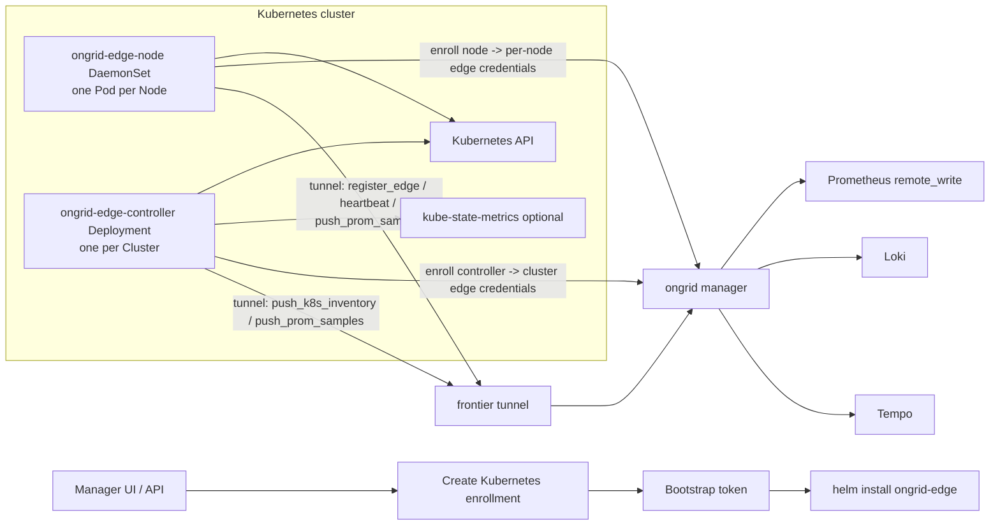
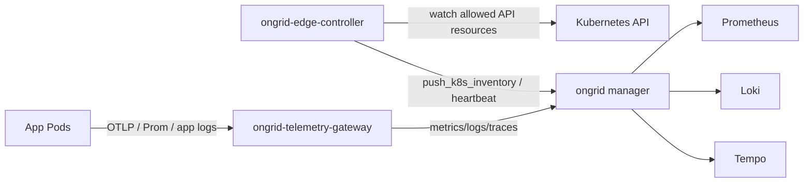

# RFC-001: Kubernetes Edge 接入适配方案

## 元信息

- 状态：草稿
- 日期：2026-06-29
- 作者：Codex
- 关联：待补 Issue / HLD / ADR
- 范围：ongrid manager、ongrid-edge、Helm/Kubernetes 部署资产、前端设备与集群视图

## 当前实现状态

2026-06-29 已落地第一批可运行闭环：

- manager 新增 `k8s_clusters`、`k8s_nodes`、`k8s_workloads`、`k8s_pods`、`k8s_events`、`k8s_installations` 表和 AutoMigrate。
- manager 新增受保护 API：`POST/GET /api/v1/k8s/clusters`、`GET/DELETE /api/v1/k8s/clusters/{cluster_id}`、`POST /api/v1/k8s/clusters/{cluster_id}/rotate-token`、`GET /api/v1/k8s/clusters/{cluster_id}/nodes|workloads|pods|events`。
- K8s 列表 API 的 `total` 已使用 DB count 返回筛选条件下的准确总数，不再使用分页结果长度。
- manager 新增 bootstrap API：`POST /internal/k8s/enroll`，由 nginx 显式代理，使用 bootstrap bearer token 认证。
- `ongrid-edge` 支持 Kubernetes bootstrap env，启动时先 enroll 获取独立 edge credentials，再连接 frontier tunnel。
- `register_edge` 支持可选 `kubernetes` 信息；node 模式继续创建/关联 host Device，controller/serverless-controller 模式不创建 host Device。
- 设备视图只展示实际 host/node Edge；controller edge 作为集群控制面接入身份保留，不在设备清单中单独成行。full-node 场景下 controller Pod 所在节点会在对应 K8s Node Edge 上标记 `K8s Controller`。
- `ongrid-edge-controller` 已通过 Kubernetes ServiceAccount 定期 list Nodes/Workloads/Pods/Events，并通过 tunnel `push_k8s_inventory` 上报当前快照；新增可选 watch 事件触发 resync，默认开启，RBAC 不足时自动降级为周期 list。
- manager 已入库 `k8s_nodes` / `k8s_workloads` / `k8s_pods` / `k8s_events` 当前快照；full-node 模式按集群范围清理本轮未出现的旧 Pod/Workload/Event，serverless/namespace 范围只清理对应 namespace。
- controller 已上报 Kubernetes List `metadata.resourceVersion`、分资源 `resource_versions` 和 `collect_duration_ms`；watch 使用对应 `resourceVersion` 续接，收到 ADDED/MODIFIED/DELETED 事件后触发快照 resync；manager 已在 `k8s_clusters` 记录 `inventory_synced_at`、`inventory_resource_version`、`inventory_scope`、`inventory_sync_duration_ms`、`inventory_watch_lag_seconds`，API 和前端详情页已展示第一版同步水位/滞后信息。
- AIOps 已新增只读工具 `query_k8s_snapshot`，默认读取 manager DB 快照，支持 summary/clusters/nodes/workloads/pods/events 以及 namespace/kind/phase/event reason 等筛选；首页默认助理白名单已包含该工具。
- AIOps 已新增只读工具 `describe_k8s_resource`，通过 controller edge 实时访问 Kubernetes API，支持 Pod/Node/Namespace/Service/Deployment/StatefulSet/DaemonSet/ReplicaSet/Job/CronJob/Event describe，并默认拒绝 Secret/ConfigMap 内容读取。
- AIOps 已新增只读工具 `query_k8s_logs`，通过 controller edge 调用 Kubernetes `pods/log` 读取单个 Pod 的有界日志片段，支持 container、previous、sinceSeconds、tailLines、limitBytes、timestamps，并作为 Loki/日志网关缺失时的小规模兜底。
- AIOps 已新增写动作工具 `execute_k8s_action` 第一版，通过 controller edge 执行 `rollout_restart`、`scale`、`delete_pod`、`evict_pod`、`cordon`、`uncordon`、`drain`，执行前实时 preflight，支持 `dry_run` 和 `expected_resource_version` 冲突保护；`drain` 已支持 `grace_period_seconds`、`ignore_daemonsets`、`delete_emptydir_data`、`force`、`disable_eviction`、PDB 429 重试和 drain timeout/retry 参数，默认跳过 DaemonSet、mirror/static、terminal、unmanaged 和 `emptyDir` Pod；工具仅作为 BaseTool 暴露，`Class="write"`，聊天运行时会进入 ReviewGate，不走 legacy closure registry。
- ReviewGate 已接入 `chat_mutating_proposals` 持久化 sink，K8s 写动作审批提案会记录 pending/decision/executed_at；`execute_k8s_action` 已从未接 ReviewGate 的 flow palette/执行 map 中排除，避免绕过聊天审批路径。
- Helm chart 已新增在 `deploy/kubernetes/ongrid-edge`，支持 `full-node`、`serverless` 模式渲染；`full-node` DaemonSet 默认使用 embedded collector 并注入 `/host/proc`、`/host/sys`，`serverless` 不渲染 DaemonSet 或 Node/host 权限。
- manager `push_prom_samples` 已支持 K8s controller/serverless-controller 无 host `device_id` 的 cluster 级指标写入：frontierbound 通过 `controller_edge_id` 校验 edge 所属集群，promwrite 注入可信 `cluster_id` / `ongrid_source`，并丢弃边端传入的 `device_id` / `edge_id`。
- `ongrid-edge-controller` 已支持通过 `ONGRID_K8S_METRICS_ENDPOINT` 可选抓取 kube-state-metrics/Prometheus 文本端点并上报 `k8s:kube-state-metrics` 样本；Helm chart 已新增 `controller.metrics.*` 参数，默认关闭，显式配置 endpoint 或启用内置 kube-state-metrics 后注入采集 env。
- `ongrid-edge-controller` 已支持第一版应用 Prometheus 指标发现：启用 `controller.metrics.appDiscovery.enabled=true` 后，controller 按 `prometheus.io/scrape=true`、`prometheus.io/port`、`prometheus.io/path` 注解发现 Pod `/metrics` endpoint，按 RBAC scope 抓取并通过 tunnel 上报 `k8s:app-metrics` 样本；默认丢弃 `pod_uid`、`instance`、container/image id、URL 等高 churn 或高基数字段。
- Helm chart 已新增 `controller.inventory.watch` 参数，默认 `true`，注入 `ONGRID_K8S_INVENTORY_WATCH` 控制 controller 是否启动 K8s watch-triggered inventory resync。
- Helm chart 已新增可选内置 kube-state-metrics：`kubeStateMetrics.enabled=true` 时渲染 Deployment/Service/ServiceAccount/RBAC，并自动把 controller metrics endpoint 指向 KSM Service；full-node 使用 ClusterRole，serverless 使用 namespace Role。
- edge logs plugin 已支持 `mode=kubernetes`：full-node K8s node edge 会自动注入 `cluster_id`、`node_name`、`pod_log_path=/host/var/log/pods/*/*/*.log` 和 Loki push endpoint fallback；promtail 渲染 CRI Pod 日志采集配置，通过 `filename` pipeline 解析并产出 `device_id`、`cluster_id`、`namespace`、`pod`、`container` 标签，默认不提升 `pod_uid` 这类高 churn 字段。
- `ongrid-edge` 镜像已内置 `promtail`、`node_exporter`、`process_exporter`、`otelcol-contrib` 到 `/usr/local/lib/ongrid-edge/`，K8s DaemonSet 可直接复用 logs/hostmetrics/procmetrics/traces 插件能力。
- traces 插件已支持 K8s full-node 默认配置：自动补真实 `device_id`、`cluster_id`、`node_name`、manager OTLP HTTP endpoint、bootstrap TLS skip 配置，并将 `/v1/traces` 规范化为 OTel exporter 需要的 base endpoint。
- controller 已支持第一版 telemetry gateway traces/logs/metrics 模式：Helm `telemetryGateway.enabled=true` 或 `mode=serverless` 时，controller 只启动 OTel collector 插件、监听 `0.0.0.0:4317/4318`，通过 `ongrid-edge-telemetry-gateway` Service 接收 OTLP traces/logs/metrics，并只注入 `cluster_id` / gateway 属性，不伪造 `device_id`；gateway 默认启用 OTel `k8sattributes` processor，按 Pod IP / Pod name+namespace / connection 关联注入 `k8s.namespace.name`、`k8s.pod.name`、`k8s.node.name` 和 workload owner 属性；logs pipeline 通过 Loki exporter 写入 manager `/loki/api/v1/push`，metrics pipeline 通过本地 Prometheus exporter 暴露给 controller，再由 `push_prom_samples` 上报 `k8s:otlp-gateway-metrics`。
- 前端已新增 `/kubernetes` 集群列表和 `/kubernetes/{cluster_id}` 集群详情页，支持创建接入、展示 Helm 安装命令、轮换 token、查看 Nodes/Workloads/Pods/Events 快照，并在 serverless 模式展示能力降级；ClusterDetail 已提供按 `cluster_id` 预置查询的 K8s metrics/logs/traces 深链入口，分别跳转 Prometheus、Loki Explore 和 Tempo Explore；serverless 模式下已新增应用遥测聚合视图，按 namespace/workload 生成应用指标、日志、链路聚合查询，并提供 workload 级快捷入口，不依赖 `device_id`。
- 2026-07-02 已补齐独立 watch-based lag 链路：controller 仅在 watch 触发的 inventory push 中上报 `watch_event_observed_at` 和 `watch_trigger_reason`，manager 使用 watch 事件观测时间计算 `inventory_watch_lag_seconds`；普通周期快照不再把“收到时间 - 采集时间”冒充 watch lag。
- 2026-07-02 已新增轻量 informer-style inventory cache 与 delta payload 协议：controller 用 full list 快照 seed/reset 本地缓存，watch ADDED/MODIFIED/DELETED 事件更新缓存并发送 `sync_type=delta` payload；delta payload 支持 Nodes/Workloads/Pods/Events upsert 以及 `deleted_nodes` / `deleted_workloads` / `deleted_pods` / `deleted_events` 显式删除；manager 对 full sync 保留原范围 prune，对 delta sync 只应用显式 upsert/delete，不再用 watch 事件触发完整快照入库。
- 2026-07-02 已补齐 K8s 写动作聊天端到端验证：`execute_k8s_action` 在 graph chatruntime 中可由 LLM tool_call 触发，先进入 ReviewGate，再写入 `chat_mutating_proposals` 审批审计，审批通过后通过 controller edge 执行 Kubernetes API dry-run preflight；agent 写动作默认受 `system_settings.agent/write_enabled=true` 开关保护，未开启时 graph runtime 只向 LLM 暴露只读工具。

本地验证：

- 在 OrbStack `ubuntu` VM 的 `/opt/ongrid` 重建并启动 manager/nginx，`https://localhost/healthz` 返回 200。
- 使用 kind 创建 `kind-ongrid-k8s` 集群，安装 Helm chart。
- `ongrid-edge-node` DaemonSet 和 `ongrid-edge-controller` Deployment 均 `1/1 Running`。
- manager API 显示集群 `kind-local` 为 `online`。
- DB 验证：controller edge `device_id=NULL`；node edge `device_id` 写入，并同步到 `k8s_nodes.device_id`。
- full-node DB/API 验证：kind 当前 Nodes=1、Workloads=17、Pods=12、Events=93；`ongrid-system` namespace 当前 Pods=2，旧滚动升级 Pod 已被快照收敛清理。
- full-node 指标验证：`ongrid-edge-node` 以 `collector_mode=embedded` 启动，Prometheus 中可查询到 `node_cpu_seconds_total{device_id="17",ongrid_source="embedded"}`。
- AIOps 运行验证：manager 启动日志 `aiops runtime wired` 的 `tool_names` 包含 `query_k8s_snapshot`、`describe_k8s_resource` 和 `query_k8s_logs`。
- Pod 日志兜底单元验证：`query_k8s_logs` 已覆盖 BaseTool `Class="read"`、controller edge 调用、参数默认值/上限、closure/BaseTool/core 注册；边端 handler 已覆盖 pods/log 路径、container/previous/tailLines/limitBytes/sinceSeconds/timestamps query 参数和 cluster_id 防串。
- 写动作单元验证：`execute_k8s_action` 已覆盖 BaseTool `Class="write"`、controller edge 调用、legacy closure registry 不暴露、rollout restart、scale、delete pod、evict pod、cordon、uncordon、drain、dry run 不写入、resourceVersion 冲突拒绝；drain 已覆盖安全默认值、DaemonSet 拒绝语义、unmanaged/emptyDir 跳过、force/delete_emptydir_data 放行、disable_eviction 直删、gracePeriodSeconds 下发、timeout/retry 参数归一化。
- 最新 Go 测试验证：`go test ./internal/pkg/tunnel ./internal/edgeagent/k8s ./internal/manager/biz/aiops/tools ./internal/manager/biz/promwrite ./internal/manager/service/frontierbound ./internal/manager/biz/k8s ./internal/manager/service/k8s ./cmd/ongrid ./cmd/ongrid-edge` 和同范围 `go test -race` 通过。
- Helm 模板验证：`full-node` 渲染包含 controller 写动作所需的 nodes patch、pods delete、pods/eviction create、apps workloads patch；`serverless` 渲染仍保持 namespace read-only，不包含 ClusterRole、DaemonSet、hostPath、hostPID、privileged 或写动作 RBAC；默认注入 `ONGRID_K8S_INVENTORY_WATCH=true`；`controller.metrics.enabled=false` 且未启用内置 KSM 时不注入 `ONGRID_K8S_METRICS_*` env；显式开启 controller metrics 或 `kubeStateMetrics.enabled=true` 后注入完整 KSM scrape env。
- 内置 KSM 验证：kind `ongrid-k8s` 中 `ongrid-system` release 已启用 `kubeStateMetrics.enabled=true` 并升级到 revision 8；`ongrid-edge-kube-state-metrics` Pod Running，KSM `/metrics` 可返回 `kube_deployment_status_replicas`；Prometheus 可查询到 `kube_deployment_status_replicas{cluster_id="1",ongrid_source="k8s:kube-state-metrics"}` 和 `up{cluster_id="1",ongrid_source="k8s:kube-state-metrics"} == 1`，新样本不含 `device_id`。
- 写动作 RBAC 验证：`full-node` controller ServiceAccount 已验证可 `patch nodes`、`create pods/eviction`、`delete pods`、`patch deployments.apps`；`serverless` controller ServiceAccount 已验证不能 `patch nodes`、不能 `create pods/eviction`、不能 `delete pods`。
- 审计持久化和 UI 验证：`mutatingProposalSink` 已用 SQLite AutoMigrate 验证可写入/更新 `chat_mutating_proposals`；ReviewGate 已验证优先使用真实 chat session id；AIOps 已提供 admin-only `GET /api/v1/aiops/mutating-proposals` 查询面，ClusterDetail 已按 `tool_name=execute_k8s_action` 读取并展示当前集群 K8s 写动作审批记录；`go test ./internal/manager/data/aiops/store ./internal/manager/service/aiops ./internal/manager/server/aiops` 通过。
- 本地构建验证：2026-06-30 使用 `deploy/docker-compose.yml` 重新构建并启动本地栈；当前 `ongrid:dev` 镜像 ID 为 `sha256:ed2c2dd7ff67761fc694f239b1fba436aa2b79ceedcd4655ce4bd824bc94c5cf`，`ongrid-web:dev` 镜像 ID 为 `sha256:204da81b030f1c86899a0ec249c68739e5463e78fd0eddcab5a98b9d80c02142`，`https://127.0.0.1:8443/healthz` 返回 `ok`，`https://127.0.0.1:8443/readyz` 返回 `ready`。
- K8s 插件单元和镜像验证：`go test -race ./internal/edgeagent/plugins ./internal/edgeagent/plugins/logs -count=1`、`go test -race ./internal/edgeagent/plugins ./internal/edgeagent/plugins/traces -count=1` 通过；新增 gateway logs 后 `go test -race ./internal/edgeagent/plugins ./internal/edgeagent/plugins/traces -count=1` 和 `go test ./cmd/ongrid-edge -count=1` 通过；新增应用指标发现后 `go test -race ./internal/edgeagent/k8s ./cmd/ongrid-edge -count=1` 通过；新增 gateway metrics 后 `go test -race ./internal/edgeagent/plugins ./internal/edgeagent/plugins/traces ./internal/edgeagent/k8s ./cmd/ongrid-edge -count=1` 通过；`make docker-ongrid-edge VERSION=v0.9.0` 已构建 `ongrid-edge:v0.9.0` 镜像 ID `sha256:73c117fbe5d9c9f4e03d243af0cb3b1a7ba5ef47b9cda774e7ef5a4c055d2ea9`；镜像内已包含 `promtail`、`node_exporter`、`process_exporter`、`otelcol-contrib`。
- K8s logs Loki 端到端验证：2026-06-30 已将 `ongrid-edge:v0.9.0` 镜像 `sha256:190894691e05cbee71e0c4bd19723dc3fbec1e27eef5a6fa5760312aa74b31d1` 加载到 kind `ongrid-k8s`，滚动重启 `ongrid-system` controller/node；edge Pod `imageID=sha256:190894691e05cbee71e0c4bd19723dc3fbec1e27eef5a6fa5760312aa74b31d1`，node 日志显示 `logs` 插件启动 `/usr/local/lib/ongrid-edge/promtail`；Loki `query_range {cluster_id="1", namespace=~".+"}` 返回包含 `namespace="kube-system"`、`pod="kube-apiserver-ongrid-k8s-control-plane"`、`container="kube-apiserver"` 的日志流，`/label/namespace/values` 返回 `kube-system`、`local-path-storage`、`ongrid-serverless`、`ongrid-system`。
- K8s traces node-local 端到端验证：`ongrid-edge-node` 最新 Pod 渲染的 `otelcol.yaml` 使用 `endpoint: https://host.docker.internal:8443`、`tls.insecure_skip_verify: true`，并注入真实 host `device_id="6"`、`cluster_id="1"`、`node_name="ongrid-k8s-control-plane"`；通过 `kubectl port-forward 14318:4318` 向 edge collector POST OTLP JSON 后返回 HTTP 200，Tempo `GET /api/traces/77777777777777777777777777777777` 返回该 span，collector 指标显示 `otelcol_receiver_accepted_spans=1`、`otelcol_exporter_sent_spans=1`、`otelcol_exporter_send_failed_spans=0`。
- K8s telemetry gateway traces 端到端验证：Helm release `ongrid-system/ongrid-edge` 设置 `telemetryGateway.enabled=true`；`ongrid-edge-telemetry-gateway` Service 暴露 `otlp-grpc:4317`、`otlp-http:4318`；controller 日志显示 `telemetry gateway plugin runtime enabled`、`enabled_names=["traces"]`、`subprocess started ... otelcol-contrib`；controller 渲染的 `otelcol.yaml` 监听 `0.0.0.0:4317/4318`、启用 `k8sattributes`，且不包含 `device_id`；通过 Service port-forward `14328:4318` POST OTLP JSON 后返回 HTTP 200，Tempo `GET /api/traces/99999999999999999999999999999999` 返回该 span，资源属性包含 `cluster_id="1"`、`telemetry_gateway="kubernetes"`、`gateway_namespace="ongrid-system"`。
- K8s telemetry gateway k8sattributes 验证：使用临时 `alpine:3.20` Pod `ongrid-trace-attr-smoke` 从集群内访问 `http://ongrid-edge-telemetry-gateway:4318/v1/traces`；Tempo `GET /api/traces/abababababababababababababababab` 返回该 span，资源属性包含 `k8s.namespace.name="ongrid-system"`、`k8s.pod.name="ongrid-trace-attr-smoke"`、`k8s.node.name="ongrid-k8s-control-plane"`、`k8s.pod.ip="10.244.0.92"`，collector 指标显示 accepted=2、sent=2、failed=0；临时 Pod 已清理。
- K8s telemetry gateway logs 端到端验证：controller 渲染的 `otelcol.yaml` 已通过 `otelcol-contrib validate`，包含 `logs` pipeline、`resource/loki_labels` processor 和 `loki/manager` exporter，且不包含 `device_id`；使用临时 `alpine:3.20` Pod `ongrid-gateway-log-smoke` 从集群内 POST OTLP JSON 到 `http://ongrid-edge-telemetry-gateway:4318/v1/logs` 后返回 `{"partialSuccess":{}}`；Loki `query_range {cluster_id="1"} |= "ongrid-gateway-otlp-log-smoke-1782809526"` 返回 1 条日志，stream labels 包含 `cluster_id="1"`、`namespace="ongrid-system"`、`pod="ongrid-gateway-log-smoke"`、`node="ongrid-k8s-control-plane"`、`service_name="ongrid-log-smoke"`、`telemetry_gateway="kubernetes"`；临时 Pod 已清理。
- K8s 应用 Prometheus 指标端到端验证：2026-06-30 重新构建 `ongrid-edge:v0.9.0` 镜像 `sha256:dbe658fa87fcb5ff124d98b5c792370a40fe418ff77a631c8431d32c89eb92b2`，加载到 kind `ongrid-k8s` 并滚动 `ongrid-system` controller/node；Helm release revision 15 设置 `controller.metrics.appDiscovery.enabled=true`、`controller.metrics.interval=10s`；临时 `alpine:3.20` Pod `ongrid-app-metrics-smoke` 暴露 `/metrics` 并带 `prometheus.io/scrape=true` 注解后，Prometheus 查询 `ongrid_app_metrics_smoke_total{cluster_id="1",namespace="ongrid-system",pod="ongrid-app-metrics-smoke",ongrid_source="k8s:app-metrics"}` 返回值 `7`，`up{target_id="ongrid-system/ongrid-app-metrics-smoke",ongrid_source="k8s:app-metrics"}` 返回 `1`，结果不含测试样本中的 `pod_uid` 和 `instance` 标签；临时 Pod 已清理。
- K8s telemetry gateway metrics 端到端验证：2026-06-30 重新构建 `ongrid-edge:v0.9.0` 镜像 `sha256:73c117fbe5d9c9f4e03d243af0cb3b1a7ba5ef47b9cda774e7ef5a4c055d2ea9`，加载到 kind `ongrid-k8s` 并滚动 `ongrid-system` controller/node；controller 渲染的 `otelcol.yaml` 已通过 `otelcol-contrib validate`，包含 `metrics` pipeline 和 `prometheus/gateway` exporter，且不包含 `device_id`；通过 `ongrid-edge-telemetry-gateway` Service POST OTLP metrics JSON 到 `/v1/metrics` 后返回 `{"partialSuccess":{}}`，collector 本地 `:9464/metrics` 暴露 `ongrid_gateway_metric_smoke{cluster_id="1",telemetry_gateway="kubernetes",service_name="ongrid-metric-smoke"} 11`；controller scrape 后 Prometheus 查询 `ongrid_gateway_metric_smoke{cluster_id="1",ongrid_source="k8s:otlp-gateway-metrics",telemetry_gateway="kubernetes",service_name="ongrid-metric-smoke"}` 返回值 `11`，`up{target_id="telemetry-gateway",ongrid_source="k8s:otlp-gateway-metrics"}` 返回 `1`。
- Watch 运行验证：`ongrid-system` 和 `ongrid-serverless` controller 日志均出现 `k8s inventory watch enabled`；对 Deployment metadata 做无害 annotation 后，full-node 与 serverless 均在约 2 秒内触发新的 `k8s inventory pushed`，未等待 30 秒周期轮询。
- 前端运行验证：`ongrid-web:dev` 已通过 `docker compose -f deploy/docker-compose.yml build nginx` 重建并重启 nginx；`npm run typecheck`、`npm run test -- Kubernetes.test.tsx`、`npm run build` 均通过。Playwright 已验证 `/kubernetes/1` ClusterDetail 在 desktop dark、desktop light、390px mobile collapsed dark 和 390px mobile Telemetry 视图下正常渲染 K8s Telemetry 深链、CrashLoopBackOff 诊断和 K8s 写动作审计卡片，截图保存于 `output/playwright/kubernetes-detail-dark-latest.png`、`output/playwright/kubernetes-detail-light-latest.png`、`output/playwright/kubernetes-detail-mobile-dark-collapsed-latest.png`、`output/playwright/kubernetes-detail-mobile-telemetry-dark-latest.png`；另使用 Playwright API mock 验证 serverless 应用遥测聚合视图在 desktop dark/light 和 390px mobile collapsed dark 下正常渲染，截图保存于 `output/playwright/kubernetes-serverless-telemetry-panel-dark-latest.png`、`output/playwright/kubernetes-serverless-telemetry-panel-light-latest.png`、`output/playwright/kubernetes-serverless-telemetry-mobile-panel-dark-latest.png`、`output/playwright/kubernetes-serverless-workload-shortcuts-mobile-dark-latest.png`。
- serverless 验证：同一 kind 集群中使用 `mode=serverless` + namespace-scoped Role 安装第二个 release，chart 未渲染 DaemonSet/ClusterRole/ClusterRoleBinding/hostPath/hostPID/privileged；ServiceAccount 不能 list/get nodes、不能 list secrets、不能 pods/exec 或 pods/attach；controller 成功 enroll，DB/API 显示 Nodes=0、Workloads=2、Pods=1、Events=6，controller edge `device_id=NULL` 且没有 host device link。
- CrashLoopBackOff 诊断验证：`query_k8s_snapshot` 支持按 Pod `reason=CrashLoopBackOff` 过滤；ClusterDetail 已通过独立 `reason=CrashLoopBackOff` Pod 查询和 Warning Event 关联展示异常 Pod、节点、重启次数、Owner 和 BackOff 事件；本地使用临时 `ongrid-crashloop-demo` Deployment 验证 light/dark/mobile 视图后已清理该测试资源。
- 独立 watch lag 单元验证：`go test ./internal/edgeagent/k8s ./internal/manager/biz/k8s ./internal/pkg/tunnel -count=1` 和同范围 `go test -race ./internal/edgeagent/k8s ./internal/manager/biz/k8s ./internal/pkg/tunnel -count=1` 通过；edge 测试覆盖 `watch_event_observed_at` / `watch_trigger_reason` 出现在 watch-triggered inventory payload，manager 测试覆盖周期快照 watch lag 为 0、watch 事件观测时间驱动 watch lag 计算。
- 独立 watch lag 本地运行验证：2026-07-02 重新构建并启动 `ongrid:dev` 镜像 `sha256:3f7064fe8de604c109fa6619f869fd1a713ba008a2314fc14e4442a0b39f4ae0`，重新构建并加载 `ongrid-edge:v0.9.0` 镜像 `sha256:58b3a7298c669eb6fafb86c9d9affa4afeb34008cd45b7d7e7d14e3938c24070` 到 kind `ongrid-k8s`，滚动 `ongrid-system` controller/node 后 Pod `imageID` 均为该 edge 镜像；`https://127.0.0.1:8443/healthz` 返回 `ok`、`/readyz` 返回 `ready`；对 `deployment/ongrid-edge-controller` 写入无害 metadata annotation 后，manager DB `k8s_clusters.inventory_watch_lag_seconds` 从周期快照的 `0` 更新为 `2`，`inventory_resource_version` 更新到 `327936`；Prometheus 查询 `up{cluster_id="1",ongrid_source="k8s:otlp-gateway-metrics"}` 返回 `1`。
- inventory delta 单元验证：`go test ./internal/edgeagent/k8s ./internal/manager/biz/k8s ./internal/manager/data/k8s/store ./internal/pkg/tunnel -count=1`、`go test ./internal/edgeagent/k8s ./internal/manager/biz/k8s ./internal/manager/data/k8s/store ./internal/manager/service/frontierbound ./internal/pkg/tunnel ./cmd/ongrid ./cmd/ongrid-edge -count=1` 以及同范围 `go test -race ... -count=1` 通过；edge 测试覆盖 watch DELETED 转成 delta delete 并更新缓存、`pushDelta` 发送 `sync_type=delta`；manager 测试覆盖 full sync 写入 Pod 后 delta `deleted_pods` 删除该 Pod，且 delta sync 不触发范围 prune。
- inventory delta 本地运行验证：2026-07-02 重新构建并启动 `ongrid:dev` 镜像 `sha256:aec1ce2c0fd37394a94e080e63aea27a72931016889ea8f6e6af64d605614ff6`，重新构建并加载 `ongrid-edge:v0.9.0` 镜像 `sha256:4ce2df9015f10af986b262f992f49a33e96e062968b85a2c0e72c6864f3b4fb5` 到 kind `ongrid-k8s`，滚动后 controller/node Pod `imageID` 均为该 edge 镜像；`https://127.0.0.1:8443/healthz` 返回 `ok`、`/readyz` 返回 `ready`；对 `deployment/ongrid-edge-controller` 写入无害 metadata annotation 后，controller 日志出现 `k8s inventory delta pushed`，payload 统计为 `workloads=3`、`deleted_* = 0`、`reason="apps/deployments:MODIFIED batch=3"`，未走 watch-triggered full snapshot；manager DB `k8s_clusters.inventory_resource_version` 更新到 `328987`，`inventory_watch_lag_seconds=2`。
- K8s 写动作聊天 E2E 单元验证：新增 `internal/manager/biz/aiops/chatruntime/k8s_action_e2e_test.go`，用脚本化 `ToolCallingChatModel` 驱动真实 graph chatruntime，覆盖 LLM 产出 `execute_k8s_action` tool_call、ReviewGate 审批、`chat_mutating_proposals` sink、controller edge caller、`chat_tool_calls` 持久化、tool lifecycle SSE 事件和最终 assistant 回复；`go test ./internal/manager/biz/aiops/chatruntime ./internal/manager/biz/aiops/tools ./internal/manager/biz/aiops/tools/decorators ./internal/manager/service/aiops ./internal/manager/server/aiops ./cmd/ongrid -count=1` 以及同范围 `go test -race ... -count=1` 通过。
- K8s 写动作真实 LLM 本地验证：本地开启 `system_settings.agent/write_enabled=true` 后，通过 `/api/v1/chat` 使用 DeepSeek `deepseek-v4-flash` 发起真实对话，session `c7563df0-b728-4981-b58b-10d842c21879` 中 LLM 第一次用错误参数调用 `execute_k8s_action` 被 ReviewGate 拒绝，第二次按 `cluster_id=1`、`action=scale`、`kind=Deployment`、`namespace=ongrid-system`、`name=ongrid-edge-controller`、`replicas=1`、`dry_run=true` 调用成功；`chat_mutating_proposals` 记录对应 `reject` 和 `approve` 两条提案，approve 行 `executed=1`；`chat_tool_calls.result_json` 返回 `controller_edge_id=2`、`dry_run=true`、`applied=false`、`message="preflight passed; dry_run=true, no Kubernetes write applied"`。

## 背景

当前 edge 以主机为中心运行：`ongrid-edge` 在被管主机上启动，主动外连 manager/frontier tunnel，不要求主机开放入站端口。首次连接后通过 `register_edge` 同步 `HostInfo`，manager 创建或更新 `Device`，后续指标、日志、trace、告警和 AI 工具统一使用 `device_id` 作为关联键。

Kubernetes 接入不能简单地把同一个 access key/secret 作为 DaemonSet Secret 发到所有 Node。原因是当前一个 edge identity 对应一个 tunnel session 和一个 host device；如果所有 Pod 复用同一个 edge identity，多节点会互相覆盖在线状态、心跳、插件健康和 `device_id` 标签。

因此 K8s 适配需要引入“集群注册 + 节点级 edge identity 自动签发”模型，同时保留现有主机 edge 的 tunnel、插件、`device_id` 和告警链路。

## 目标

- 一个 Kubernetes 集群可以通过 Helm 一次性接入 ongrid。
- 标准集群中，每个 Node 都能作为一个 `Device` 出现在现有 Devices / Monitor / Alerts / AI 工具链路里。
- serverless / 无节点权限集群中，允许以 cluster / namespace / workload 为主体接入，不强依赖 Node、DaemonSet、hostPath、kubelet 或 `device_id`。
- 集群、Namespace、Workload、Pod 等 K8s 对象能被发现、查询，并按能力关联到 Node/Device 或 cluster/namespace/workload。
- 指标、日志、trace 仍走现有 manager 数据面，优先复用 `push_prom_samples`、Loki、Tempo、插件健康上报。
- 默认只读、最小权限；危险能力如 shell、restart service、host 文件扫描默认关闭。
- 不破坏现有 systemd/binary edge 安装路径。

## 非目标

- 第一阶段不做跨集群调度、部署发布、自动修复等写操作。
- 第一阶段不要求接管用户已有 Prometheus Operator / Fluent Bit / OTel Operator。
- 第一阶段不把所有 Pod 历史状态长期落 MySQL；Pod 高 churn 数据以“当前快照 + 短保留事件”为主。

## 总体决策

采用“能力分级 + 双组件接入”：

1. `ongrid-edge-node` DaemonSet：每个 Node 一个 edge agent Pod。负责节点身份、节点主机指标、节点本地日志、节点级插件健康和受控的只读诊断能力。
2. `ongrid-edge-controller` Deployment：每个集群一个控制器。负责 Kubernetes API watch、集群级资源快照、kube-state-metrics/可选集群指标采集、集群级插件健康。
3. 新增 Kubernetes 集群注册域：manager 创建 `k8s_cluster` 记录和 bootstrap token，Helm 安装时只拿 bootstrap token。DaemonSet/Deployment 启动后用 bootstrap token 交换自己的独立 edge access key/secret。
4. 继续让 edge 主动外连 tunnel。K8s 集群只需要能出站访问 manager 的 HTTPS 和 tunnel 端口，不开放集群入站端口。

能力等级：

- `full-node`：允许 DaemonSet、hostPath、hostPID、读取 kubelet/cAdvisor。提供 Node Device、主机指标、进程指标、节点日志、节点级诊断。
- `serverless`：不允许 DaemonSet 或 Node 权限，仅部署 controller/gateway。以 cluster、namespace、workload 为主体接入；不创建 Node Device，不暴露 host 操作能力。

职责边界：

| 组件 | 代表对象 | 主要数据源 | 写动作边界 |
| --- | --- | --- | --- |
| `ongrid-edge-node` | 单个 Node / host Device | 节点 OS、hostPath、进程、节点日志、node_exporter/process-exporter | 只做节点级动作，例如受控 shell、文件/网络诊断、systemd/service 操作 |
| `ongrid-edge-controller` | 整个 K8s 集群 | Kubernetes API、kube-state-metrics、Events | 只做 K8s API 动作，例如 rollout restart、scale、delete pod、cordon/drain |
| `ongrid-telemetry-gateway` | 应用遥测入口 | OTLP、应用 `/metrics`、云日志出口 | 不执行写动作，只接收和转发遥测 |

原则：

- Pod / Deployment / PVC / Event 等 K8s 对象查询和 K8s 写动作走 controller。
- Node CPU / 内存 / 磁盘 / 网络 / 进程 / 文件 / 节点日志等现场能力走 edge。
- 不让 edge 通过 `kubectl` 做集群写动作，避免绕过 Kubernetes RBAC 和审计。
- 不让 controller 假装成 Node，也不把 controller edge id 写成 `device_id`。



## 接入流程

### 1. 创建集群注册

新增 manager API：

- `POST /v1/k8s/clusters`：创建集群注册，返回 `cluster_id`、安装命令、bootstrap token 明文。
- `GET /v1/k8s/clusters`：分页列出集群。
- `GET /v1/k8s/clusters/{id}`：详情、节点数、在线状态、最近同步时间。
- `POST /v1/k8s/clusters/{id}/rotate-token`：轮换 bootstrap token。
- `DELETE /v1/k8s/clusters/{id}`：删除/停用集群，并可选择停用关联 edge。

实现上应先新增 `api/manager/k8s/v1/k8s.proto`，HTTP handler 再映射到 REST，符合项目 proto 优先约束。

### 2. Helm 安装

新增 `deploy/kubernetes/ongrid-edge` Helm chart，manager 会通过 `/edge/k8s/ongrid-edge.tgz` 提供可下载 chart。用户执行：

```bash
helm upgrade --install ongrid-edge https://<manager>/edge/k8s/ongrid-edge.tgz \
  --insecure-skip-tls-verify \
  --namespace ongrid-system --create-namespace \
  --set namespace.create=false \
  --set-string manager.publicURL=https://<manager> \
  --set-string manager.tunnelAddr=<manager>:40012 \
  --set-string manager.tlsInsecure=true \
  --set-string enrollment.clusterID=<cluster_id> \
  --set-string enrollment.bootstrapToken=<bootstrap_token>
```

Helm 创建：

- `Namespace`
- bootstrap `Secret`
- `ConfigMap`
- node DaemonSet
- cluster controller Deployment
- ServiceAccount / ClusterRole / ClusterRoleBinding
- 可选 Service：OTLP receiver、debug metrics
- 可选 NetworkPolicy

controller inventory 默认 `controller.inventory.watch=true`，会在首次快照后对允许的 K8s 资源启动 watch，收到变更事件后触发快照 resync；如果目标集群 watch 权限受限，可通过 `--set controller.inventory.watch=false` 退回纯周期 list。

### 3. 节点自动换取 edge 身份

DaemonSet Pod 启动时读取 Downward API：

- `NODE_NAME`
- `POD_NAME`
- `POD_NAMESPACE`
- `POD_UID`

再从 Kubernetes API 读取当前 Node 的 `metadata.uid`、`providerID`、labels、taints、capacity、allocatable。然后调用 manager bootstrap API：

```text
POST /internal/k8s/enroll
Authorization: Bearer <bootstrap_token>
body:
  cluster_id
  cluster_uid
  role = "node"
  node_name
  node_uid
  provider_id
  agent_version
```

manager 验证 token 后，按 `(cluster_id, node_uid, role=node)` 幂等创建或复用一个 edge identity，返回该 Node 专属 `access_key` / `secret_key`。edge 用这对凭证连接 tunnel，并在 `register_edge` 里带上 K8s 节点信息。

控制器 Deployment 同样 enroll，但 `role=controller`，用于集群级 watch 和集群指标；它不代表某个主机 Device。

### 4. register_edge 扩展

保持现有 `register_edge` 兼容，新增可选字段：

```protobuf
message KubernetesInfo {
  string mode = 1;        // node / controller
  uint64 cluster_id = 2;
  string cluster_uid = 3;
  string cluster_name = 4;
  string node_name = 5;
  string node_uid = 6;
  string namespace = 7;
  string pod_name = 8;
}
```

manager 收到 node 模式的 `register_edge` 后：

- 继续走现有 `Device` upsert、`edge_devices(type=host)` link、`Edge.DeviceID` 同步。
- 同步 `k8s_nodes.device_id` / `edge_id`。
- 将 `Device.Name` 默认设为 node name，`Device.Roles` 默认 `server`，后续允许用户覆盖。

controller 模式的 edge 不创建 host `Device`；它只更新 `k8s_clusters.last_seen_at` 和插件健康。

### 5. Serverless / 无节点权限模式

Serverless Kubernetes 常见限制：

- 不能部署 DaemonSet。
- 不能使用 hostPath、hostPID、privileged。
- 不能访问 kubelet `/metrics`、`/metrics/cadvisor` 或节点 `/proc`、`/sys`。
- 可能不能 list/watch cluster-scoped resources，只能在一个或多个 namespace 内只读。
- 节点由云厂商隐藏，Node 名称、Node UID、providerID 不稳定或不可见。

这种场景不能使用“每个 Node 一个 edge + 每个 Node 一个 Device”的模型。推荐改为 controller-only 接入：



安装参数：

```bash
helm upgrade --install ongrid-edge https://<manager>/edge/k8s/ongrid-edge.tgz \
  --insecure-skip-tls-verify \
  --namespace ongrid-system --create-namespace \
  --set namespace.create=false \
  --set-string mode=serverless \
  --set-string manager.publicURL=https://<manager> \
  --set-string manager.tunnelAddr=<manager>:40012 \
  --set-string manager.tlsInsecure=true \
  --set-string enrollment.clusterID=<cluster_id> \
  --set-string enrollment.bootstrapToken=<bootstrap_token> \
  --set-string rbac.scope=namespace
```

serverless enroll：

```text
POST /internal/k8s/enroll
Authorization: Bearer <bootstrap_token>
body:
  cluster_id
  role = "serverless-controller"
  namespace
  agent_version
  capabilities = ["k8s_inventory", "workload_metrics", "otel_gateway"]
```

manager 为该安装创建一个 controller edge identity，但不创建 host Device、不写 `edge_devices(type=host)`。资源和遥测以 `cluster_id`、`namespace`、`workload_kind`、`workload_name`、`service.name` 为主键查询。现有 host tools 必须隐藏或返回“serverless 模式不支持”。

serverless 模式下的能力取舍：

| 能力 | full-node | serverless |
| --- | --- | --- |
| Node Device | 支持 | 不支持 |
| host CPU/mem/disk/proc | 支持 | 不支持 |
| kube-state-metrics | 支持 | 支持 |
| Pod/Workload 状态 | 支持 | 支持，按 RBAC 范围 |
| Pod stdout 文件采集 | 支持，读 `/var/log/pods` | 不支持 |
| 应用 Prometheus 指标 | 支持 | 支持，应用暴露 endpoint 或推 OTLP |
| Trace | 支持 | 支持，走 gateway |
| WebShell / restart_service / host_files | 可选高风险 | 不支持 |

## 数据模型

新增 manager/k8s bounded context，按 `cmd -> server -> service -> biz -> data -> model` 分层，不让 edge/device 直接 import k8s 业务包。跨域通过窄接口或事件衔接。

### k8s_clusters

- `id`
- `name`
- `uid`
- `status`：online/offline/degraded
- `bootstrap_token_hash`
- `bootstrap_token_expires_at`
- `controller_edge_id`
- `version`
- `last_seen_at`
- `inventory_resource_version`
- `inventory_resource_versions_json`
- `inventory_scope`
- `inventory_namespace`
- `inventory_sync_duration_ms`
- `inventory_watch_lag_seconds`
- `inventory_synced_at`
- `created_by`
- `created_at` / `updated_at` / soft delete

索引：

- unique `(uid, delete_marker)`
- index `(status, last_seen_at)`

### k8s_nodes

- `id`
- `cluster_id`
- `node_name`
- `node_uid`
- `provider_id`
- `edge_id`
- `device_id`
- `labels_json`
- `taints_json`
- `conditions_json`
- `capacity_json`
- `allocatable_json`
- `kubelet_version`
- `last_seen_at`
- `created_at` / `updated_at`

索引：

- unique `(cluster_id, node_uid)`
- index `(cluster_id, node_name)`
- index `(device_id)`
- index `(edge_id)`

### k8s_workloads

用于 Deployment / StatefulSet / DaemonSet / Job / CronJob 的当前快照：

- `cluster_id`
- `namespace`
- `kind`
- `name`
- `uid`
- `desired_replicas`
- `ready_replicas`
- `labels_json`
- `annotations_json`
- `conditions_json`
- `last_seen_at`

索引：

- unique `(cluster_id, kind, namespace, name)`
- index `(cluster_id, namespace, kind)`

### k8s_pods

只存当前或短期状态，避免把高 churn 历史长期写入 MySQL：

- `cluster_id`
- `namespace`
- `name`
- `uid`
- `node_name`
- `phase`
- `owner_kind`
- `owner_name`
- `restart_count`
- `reason`
- `last_seen_at`

索引：

- unique `(cluster_id, namespace, name, uid)`
- index `(cluster_id, node_name)`
- index `(cluster_id, namespace, phase)`

Pod 当前快照在 controller 下一轮上报时按快照范围收敛删除；若后续增加 Pod 事件或历史状态，再单独设置 24h 或 7d TTL。

### k8s_events

只存当前 Kubernetes API 可见的 Event 快照，用于 ClusterDetail、异常 Pod 诊断和 AI 只读查询：

- `cluster_id`
- `namespace`
- `name`
- `uid`
- `type`
- `reason`
- `message`
- `involved_kind`
- `involved_namespace`
- `involved_name`
- `involved_uid`
- `source_component`
- `source_host`
- `reporting_controller`
- `reporting_instance`
- `action`
- `count`
- `first_timestamp`
- `last_timestamp`
- `event_time`
- `last_seen_at`

索引：

- unique `(cluster_id, uid)`
- index `(cluster_id, namespace, reason)`
- index `(involved_kind, involved_namespace, involved_name)`
- index `(cluster_id, last_seen_at)`

Event 当前快照在 controller 下一轮上报时按快照范围收敛删除；不长期保存无限 Event 历史。

### k8s_installations

记录一次 Helm/namespace 安装实例，用于 serverless 或 namespace-scoped 场景：

- `id`
- `cluster_id`
- `mode`：full-node / serverless
- `scope_type`：cluster / namespace
- `namespace`
- `controller_edge_id`
- `capabilities_json`
- `last_seen_at`
- `created_at` / `updated_at`

索引：

- unique `(cluster_id, scope_type, namespace)`
- index `(mode, last_seen_at)`

serverless 模式下，`k8s_nodes` 可以为空；`k8s_pods.node_name` 允许为空。所有查询必须能处理 “workload 有数据但没有 Node/Device” 的情况。

## 边端组件设计

### ongrid-edge-node

运行方式：DaemonSet，每个 Node 一个 Pod。

主要职责：

- bootstrap 换取该 Node 专属 edge credentials。
- 连接 tunnel，执行现有 `register_edge` / `heartbeat` / plugin config fetch。
- 汇报 Node host metrics、process metrics、日志、插件健康。
- 可选读取 kubelet/cAdvisor 指标。
- 默认禁用 shell、webshell、restart_service、通用 bash。

推荐 Pod 配置：

- `readOnlyRootFilesystem: true`
- `emptyDir` 挂载 `/var/lib/ongrid-edge`
- hostPath 只读挂载：
  - `/proc -> /host/proc`
  - `/sys -> /host/sys`
  - `/ -> /host/root`
  - `/var/log/pods`
  - `/var/log/containers`
- 需要 process metrics 时启用 `hostPID: true`
- 默认不启用 `privileged`
- `resources.requests`: `cpu: 50m`, `memory: 128Mi`
- `resources.limits`: `cpu: 500m`, `memory: 512Mi`

现有 edge 镜像是 distroless 且只包含 `ongrid-edge`；K8s 方案需要新增镜像构建 target，把 node_exporter、process-exporter、promtail、otelcol-contrib 一起放到 `/usr/local/lib/ongrid-edge`。

### ongrid-edge-controller

运行方式：Deployment，默认 1 副本，后续可 leader election。

主要职责：

- bootstrap 换取 cluster-controller edge credentials。
- Watch Kubernetes API，定期发送资源快照/增量。
- 采集 kube-state-metrics，避免每个 Node 重复抓同一份集群指标。
- 汇报集群级健康：API watch lag、resourceVersion、list/watch error、RBAC deny。

资源 watch 范围：

- nodes
- namespaces
- pods
- services
- endpoints/endpointslices
- deployments/statefulsets/daemonsets/replicasets
- jobs/cronjobs
- pvc/pv/storageclasses
- ingress
- events

不读取 Secrets，不执行 update/delete/exec。

### ongrid-telemetry-gateway

运行方式：Deployment，serverless 模式默认启用，full-node 模式可选。

职责：

- 提供集群内 OTLP HTTP/gRPC endpoint，接收应用 metrics/logs/traces。
- 使用 OTel `k8sattributes` processor 注入 namespace / pod / workload / node 信息；如果 RBAC 不允许 watch pods，则要求应用通过 Downward API 注入资源属性。
- 将 metrics 通过 manager 数据面写入 Prometheus，将 logs 写入 Loki，将 traces 写入 Tempo。
- 不访问 Node 文件系统，不需要 privileged。

serverless 模式下，应用接入优先级：

1. 应用 SDK/OTel Collector 向 `ongrid-telemetry-gateway` 推 OTLP。
2. 应用暴露 `/metrics`，controller 根据 Service/annotation 发现并 scrape。
3. 云厂商日志服务导出到 Loki/HTTP endpoint。
4. `pods/log` API 轮询仅作为小规模兜底，不作为默认方案。

## 插件与遥测方案

### 指标

节点指标：

- 当前第一阶段最小闭环：`full-node` DaemonSet 设置 `ONGRID_EDGE_COLLECTOR_MODE=embedded`，并通过 `HOST_PROC=/host/proc`、`HOST_SYS=/host/sys` 让 gopsutil 读取宿主机视角的 CPU、内存、load、网络等基础指标；manager 继续通过 `push_prom_samples` 注入可信 `device_id` 后写入 Prometheus。
- `hostmetrics` 以 node_exporter 子进程暴露 `/metrics`。
- K8s 模式下 node_exporter 参数需要改成 hostPath：
  - `--path.procfs=/host/proc`
  - `--path.sysfs=/host/sys`
  - `--path.rootfs=/host/root`
  - `--collector.filesystem.mount-points-exclude=^/(dev|proc|sys|run|var/lib/containerd/.+)($|/)`
- `procmetrics` 以 process-exporter 子进程读取 host `/proc`。
- `metrics` 插件继续 scrape `127.0.0.1:9102` 和 `127.0.0.1:9256`，通过 tunnel `push_prom_samples` 给 manager，由 manager 注入可信 `device_id`。

集群指标：

- controller 可通过 `ONGRID_K8S_METRICS_ENDPOINT` 只抓一次 kube-state-metrics 或兼容 Prometheus text endpoint，Helm `controller.metrics.*` 可显式开启；若启用 `kubeStateMetrics.enabled=true`，chart 会内置部署 KSM 并自动配置 controller scrape endpoint。
- controller 可通过 `controller.metrics.appDiscovery.enabled=true` 发现带 `prometheus.io/scrape=true` 注解的 Pod 应用指标 endpoint，并以 `k8s:app-metrics` source 上报；发现范围遵守 full-node/serverless 的 RBAC scope。
- telemetry gateway 可接收 OTLP metrics，OTel collector 转成本地 Prometheus exporter，controller 抓取 `127.0.0.1:9464/metrics` 并以 `k8s:otlp-gateway-metrics` source 上报。
- source label 使用 `k8s:kube-state-metrics`、`k8s:app-metrics` 或 `k8s:otlp-gateway-metrics`。
- 增加低基数字段：`cluster_id`、`cluster_name`、`namespace`、`workload_kind`、`workload_name`。
- 默认 drop 高 churn 标签：`pod_uid`、`container_id`、image digest、controller revision hash。

可选 cAdvisor：

- DaemonSet 可抓本机 kubelet `/metrics/cadvisor`。
- 默认关闭；开启时必须设置 sample limit 和 label drop。

serverless 指标：

- 不采集 node_exporter、process-exporter、kubelet/cAdvisor。
- 优先采集 kube-state-metrics、metrics-server 暴露的聚合资源、应用 Prometheus endpoint、OTLP metrics。
- 指标标签以 `cluster_id`、`namespace`、`workload_kind`、`workload_name`、`service` 为主；`pod` 只用于短窗口排障，默认不作为告警聚合维度。
- manager 的 promwrite 对 K8s source 使用 cluster 级标签族，不强制注入 `device_id`，并拒绝保留边端自带的 `device_id` / `edge_id`，避免把 controller edge 误归因成 Node。

### 日志

现有 logs 插件默认 journald/file paths，不适合 K8s 主路径。新增 logs spec：

```json
{
  "mode": "kubernetes",
  "node_name": "${NODE_NAME}",
  "pod_log_path": "/var/log/pods/*/*/*.log",
  "attach_kubernetes_labels": true,
  "label_drop": ["pod_uid", "container_id", "controller_revision_hash"]
}
```

渲染 promtail 时：

- 使用 Kubernetes SD 或 CRI file tail。
- 只保留当前 Node 的 Pod 日志，避免 DaemonSet 互相重复。
- 外部标签保留 `device_id`，额外加 `cluster_id`、`node`。
- Pod 级标签只保留 `namespace`、`pod`、`container`、`workload_kind`、`workload_name`。

serverless 日志：

- 不 tail `/var/log/pods`，因为没有 Node 文件系统权限。
- 默认走 OTLP logs gateway 或云厂商日志导出。
- 如果允许 `pods/log`，controller 可以按 namespace 小规模读取最近日志，但必须限制并发、限流、最大字节数和保留窗口；该路径不适合高吞吐生产日志。
- Loki 查询主键使用 `{cluster_id="...", namespace="...", workload_name="..."}`，而不是 `{device_id="..."}`。

### Trace

第一阶段不强制接入 trace。第二阶段提供两种模式：

- Node-local DaemonSet OTLP receiver：适合按 Node 归因，需要应用把 OTLP endpoint 指向本节点 collector。
- Cluster gateway Deployment：适合统一接入，使用 OTel `k8sattributes` processor 注入 namespace/pod/workload/node，再由 manager 通过 node 映射补 `device_id` 或以 `cluster_id` 为主查询。

默认推荐先做 cluster gateway，因为用户接入成本低。

serverless trace：

- 只支持 cluster gateway。
- 应用通过 OTLP exporter 指向 `http://ongrid-telemetry-gateway.ongrid-system:4318` 或 gRPC `:4317`。
- 如果 gateway 无法 watch pods，则要求应用通过 Downward API 设置 `k8s.namespace.name`、`k8s.pod.name`、`service.name`、`service.version`。

## Kubernetes RBAC

拆两个 ServiceAccount：

- `ongrid-edge-node`
- `ongrid-edge-controller`

`ongrid-edge-node`：

- get/list/watch nodes：只为读取本 Node 信息，若要严格最小化可通过 admission 或启动参数只读取自身 Node。
- get/list/watch pods：用于本 Node 日志 relabel。
- get `nodes/metrics` 或 `nodes/proxy`：仅在开启 kubelet/cAdvisor scrape 时需要。
- 不允许 secrets。
- 不允许 update/delete/exec。

`ongrid-edge-controller`：

- get/list/watch 上述只读资源。
- get pods/log：仅作为单 Pod 最近日志的小规模兜底；生产日志检索优先走 Loki、OTLP logs gateway 或云厂商日志导出。
- events 只读。
- 不允许 secrets。
- full-node 可显式开启受限写动作 RBAC：`patch` apps workloads 用于 rollout restart/scale，`delete` pods 用于 delete pod，`create` pods/eviction 用于 evict/drain，`patch` nodes 用于 cordon/uncordon/drain。
- 所有写动作必须经 manager `execute_k8s_action` preflight、ReviewGate 审批和审计，不允许边端绕过 manager 审批自行执行。
- 聊天 agent 的写工具暴露受 `system_settings` 中 `category='agent'`、`key='write_enabled'` 控制；只有值为 `true` 时 graph runtime 才向 LLM 暴露 `Class="write"` / destructive 工具，缺省保持只读。

serverless 最小 RBAC：

- namespace scope 优先：只在目标 namespace 创建 Role/RoleBinding。
- 允许 get/list/watch pods、deployments、statefulsets、daemonsets、replicasets、jobs、cronjobs、services、endpoints、events，并允许 get pods/log 作为有界日志兜底。
- 如果要用 OTel `k8sattributes`，允许 watch pods。
- 如果要用 kube-state-metrics，可由 chart 部署 namespace-scoped kube-state-metrics 或接入用户已有实例。
- 不授予 nodes、nodes/proxy、nodes/metrics、secrets、pods/exec、pods/attach、pods/portforward，也不授予 pods delete、pods/eviction create 或 workload/node patch。

NetworkPolicy：

- 允许出站到 manager public URL / tunnel addr。
- 允许出站到 kube-apiserver。
- 允许 DNS。
- 默认拒绝其他出站，需允许用户按需扩展。

## Manager 侧改造

### API 和服务

新增 `internal/manager/{server,service,biz,data,model}/k8s`。

边界：

- k8s biz 不直接 import edge/device data 实现。
- 通过接口调用 edge usecase 创建/复用 edge credentials。
- 通过 device repo 或 edge register hook 同步 Node 到 Device。

### Tunnel 方法

新增：

- `push_k8s_inventory`：controller 推 Nodes / Workloads / Pods / Events 当前快照。
- `get_k8s_capabilities`：manager 查询边端支持的 K8s 能力和版本。

可选：

- `push_k8s_events`：如果后续需要更高频的 Event 增量流，可拆成独立方法并写 MySQL 短保留或转 Loki。
- K8s 只读诊断走 `describe_k8s_resource` / `query_k8s_logs`；受控写动作走 `execute_k8s_action`，并通过 ReviewGate 与审批审计保护。

### 快照与实时查询策略

Kubernetes API 是实时真相来源，但 manager 需要存一份轻量当前快照。不要每次 UI / 首页问答 / 告警都实时打 K8s API，也不要长期保存完整对象历史。

快照用途：

- 列表、概览、分页和搜索。
- 告警评估，例如 Pod Pending 超时、Deployment ready 副本不足。
- AI 关联，例如 `pod -> node -> edge/device -> logs/metrics`。
- controller 短暂离线时展示最后一次同步状态。
- 降低多用户、多页面、多工具重复访问 Kubernetes API 的限流风险。

快照存储内容：

- 资源身份：`cluster_id`、`uid`、`namespace`、`kind`、`name`。
- 当前状态：phase、reason、message、conditions、ready/desired replicas。
- 关联字段：owner kind/name、node name、device_id、edge_id。
- 同步字段：resource_version、generation、observed_generation、last_seen_at、deleted_at。

不存储：

- Secret 内容。
- ConfigMap 大内容；最多存 metadata 和 hash。
- `managedFields`。
- 大段 annotation。
- 无限 Pod 历史状态。
- 高 churn 的完整对象 JSON 长期保留。

实时 API 查询只用于：

- 详情页的最新 `describe`。
- 写动作前 preflight，例如 restart / scale / delete pod。
- 拉取当前 Events。
- 少量 Pod logs 兜底。
- 校验资源仍存在、resourceVersion 未冲突、RBAC 允许。

### 首页问答数据源路由

首页 AI 问答默认先读 manager DB 快照。只有用户明确要求“最新 / 立刻 / describe / 执行 / 重启 / 删除 / 扩容”，或执行动作前校验，才通过 controller 实时访问 K8s API。

工具划分：

- `query_k8s_snapshot`：查 DB 快照，用于列表、统计、关联、概览。
- `describe_k8s_resource`：通过 controller 实时查 Kubernetes API。
- `execute_k8s_action`：通过 controller 执行 K8s 写动作，强制 preflight、审批、审计。
- `query_k8s_metrics`：查 Prometheus，用于资源用量和业务指标。
- `query_k8s_logs`：优先查 Loki 或日志网关；当前第一版可通过 controller `pods/log` 小规模兜底读取单个 Pod 最近日志，用于错误日志和应用输出。
- `query_k8s_traces`：查 Tempo，用于链路延迟和依赖分析。
- `query_node_edge`：从 Pod/Node 关联到 `device_id` 后调用 edge 能力，用于节点现场排障。

默认路由：

| 用户问题 | 数据源 |
| --- | --- |
| 当前有多少 Pod | DB 快照 |
| 哪些 Pod 异常 | DB 快照 + Events 快照 |
| Deployment 状态怎么样 | DB 快照 |
| 立刻 describe 这个 Pod | controller 实时 K8s API |
| 重启这个 Deployment | controller 实时 K8s API preflight + 写动作 |
| 这个节点 CPU 怎么样 | Prometheus / edge metrics |
| 这个 Pod 所在节点现场怎么样 | DB 快照定位 node，再查对应 edge/device |

### 前端

新增页面：

- `KubernetesClusters`：集群列表、安装命令、在线状态、Node 覆盖率。
- `KubernetesClusterDetail`：Nodes、Namespaces、Workloads、Pods、Events。

现有 Devices/Monitor 保持以 `device_id` 为中心；Node device 点击后可跳转到所属 Kubernetes Node。serverless 集群不展示 Node Device 覆盖率，改展示能力矩阵：inventory、metrics、logs、traces、events、host access。Host 级操作按钮在 serverless 模式下隐藏。

UI 约束：

- 文案使用 `tr('中文','English')`。
- 复用 `web/src/components/ui/` 的 Card/Button/PageHeader/EmptyState。
- K8s 状态使用 Chip tone，不使用大面积彩色正常态。

## 告警与 SLO

新增内置规则：

- `k8s_node_not_ready`
- `k8s_pod_crashloop`
- `k8s_image_pull_backoff`
- `k8s_pod_pending`
- `k8s_pvc_pending`
- `k8s_daemonset_coverage_low`
- `k8s_controller_watch_lag`
- `edge_offline` 继续复用现有规则

serverless 模式启用 workload/cluster 规则，禁用 Node 规则：

- `k8s_deployment_unavailable`
- `k8s_pod_crashloop`
- `k8s_pod_pending`
- `k8s_hpa_maxed`
- `k8s_quota_near_limit`
- `k8s_telemetry_missing`
- `k8s_controller_watch_lag`

SLO 初版：

- 95% Node edge 在 2 分钟内完成注册。
- K8s informer watch lag 小于 60 秒。
- Node 指标端到端延迟小于 90 秒。
- DaemonSet 覆盖率大于 95%，不可调度/tainted 节点除外。
- serverless controller 在 2 分钟内完成注册。
- serverless workload 状态同步延迟小于 60 秒。
- serverless 应用遥测端到端延迟小于 90 秒。

## 安全设计

- bootstrap token 只用于 enroll，服务端存 Argon2id hash，不回显。
- per-node access key/secret 由 manager 签发，不在 Helm values 中硬编码。
- bootstrap token 支持 TTL、轮换、撤销。
- enroll API 必须按 token、cluster_id、source IP 做速率限制。
- K8s RBAC 默认只读，不读取 Secrets。
- remote shell、restart_service、generic bash 在 K8s 模式默认关闭。
- 日志和指标 label 需要 allowlist，禁止把 URL、user_id、email、pod UID 等高基数/敏感字段作为默认 Prom label。
- hostPath 全部只读；需要写的目录只用 `emptyDir`。
- 镜像以非 root 为目标；如果日志权限导致必须 root，要在 chart values 中显式开启 `securityContext.runAsUser=0`，并在文档标成高风险选项。
- serverless 模式禁止安装任何 hostPath、hostPID、privileged、DaemonSet 资源；chart template 层面应按 `mode=serverless` 直接不渲染这些对象。

## 兼容性

- 现有 `docs/install/edge.md` 的主机安装不变。
- `register_edge` 新字段全部 optional，旧 agent 可继续注册。
- manager 未开启 K8s 功能时，edge host 模式不受影响。
- Prometheus 默认查询仍优先 `device_id`，K8s 额外标签只用于筛选和分组。
- serverless 遥测不保证存在 `device_id`；K8s 页面、K8s 告警和 K8s AI 工具必须优先使用 `cluster_id` / `namespace` / `workload` 标签。

## 风险与缓解

| 风险 | 影响 | 缓解 |
| --- | --- | --- |
| DaemonSet 复用同一 edge 凭证 | 多节点互相覆盖在线状态和 device_id | bootstrap token 换取 per-node edge credentials |
| K8s label 高基数 | Prom/Loki 成本失控 | 默认 label allowlist + label_drop + sample_limit |
| hostPath/RBAC 过宽 | 安全风险 | 默认只读、禁 secrets、禁写操作，危险能力 opt-in |
| 每个 Node 重复采集 kube-state-metrics | 指标重复和成本增加 | 集群 controller 单点采集 KSM |
| manager 注入 device_id 与边端自带标签不一致 | 查询错乱 | 指标继续由 manager 注入 device_id；日志/trace 后续统一云端可信映射 |
| K8s API watch 断开 | 资源快照过期 | informer reconnect + resync + watch lag 告警 |
| distroless edge 镜像缺插件二进制 | 插件全部 crashed | 新增 k8s edge image，把插件 bundle 进镜像并加启动自检 |
| serverless 无 Node/host 权限 | Host Monitor、host tools 不可用 | 以 cluster/workload 为主体，UI 显示能力降级并隐藏 host 操作 |
| serverless 日志只能走应用/云厂商出口 | 无法读取容器 stdout 文件 | 提供 OTLP logs gateway、云日志导出和小规模 pods/log 兜底 |
| 把 controller edge 当作 device_id | 所有 workload 误归因到一个假 Node | serverless promwrite 不注入 Node device_id，使用 K8s 标签族 |

## 分阶段实施

### Phase 0：设计与骨架

- 创建 RFC/HLD/ADR。
- 定义 `api/manager/k8s/v1/k8s.proto`。
- 定义 `k8s_clusters` / `k8s_nodes` 最小模型。
- 定义 K8s 快照表、实时 API 工具和首页问答数据源路由。
- 增加 Helm chart 初始骨架。

验收：

- API/数据模型评审通过。
- 快照字段、禁止存储字段、实时 API 查询边界评审通过。
- Helm template 能渲染 Namespace、Secret、RBAC、DaemonSet、Deployment。

### Phase 1：节点接入最小闭环

- 实现 `/internal/k8s/enroll`。
- edge 增加 `ONGRID_EDGE_MODE=k8s-node|k8s-controller`。
- DaemonSet Pod 自动换取 per-node edge credentials。
- Node 模式 `register_edge` 同步 Device 和 `k8s_nodes`。
- K8s node host metrics 进入 Prom，现有 Monitor 可按 `device_id` 查询。
- plugin health 在 EdgeDetail 可见。

验收：

- kind/k3d 三节点集群安装后，Devices 出现三个在线 Node。
- 每个 Node 的 `node_cpu_seconds_total{device_id="..."}` 可查。
- 删除一个 DaemonSet Pod 后 2 分钟内自动恢复在线。
- 停掉一个 Node agent 后触发 offline 规则。

### Phase 1b：Serverless 最小闭环

- Helm `mode=serverless` 不渲染 DaemonSet、hostPath、hostPID、privileged。
- controller 用 namespace-scoped Role 完成 enroll。
- controller 推 `k8s_workloads` / `k8s_pods` / `k8s_events` 当前快照。
- telemetry gateway 接收 OTLP metrics/traces/logs。
- K8s 页面按 cluster/namespace/workload 查询，不依赖 Node Device。

验收：

- 在不授予 nodes 权限的集群中安装成功。
- ServiceAccount 不能 list secrets、不能 get nodes。
- ClusterDetail 可显示目标 namespace 的 Workloads/Pods/Events。
- PromQL 可按 `cluster_id` + `namespace` + `workload_name` 查询应用指标。
- Host Monitor、WebShell、restart_service、host_files 在 serverless 模式不可用且 UI 不展示入口。

### Phase 2：集群资源和日志

- controller watch Nodes/Pods/Workloads/Events。
- 新增集群列表/详情 API。
- 新增 `query_k8s_snapshot`、`describe_k8s_resource` 和 `query_k8s_logs` 兜底工具。
- logs plugin 支持 `mode=kubernetes`。
- Pod 日志进入 Loki；节点模式带 `device_id`、`cluster_id`、`namespace`、`pod`、`container`，serverless 模式带 `cluster_id`、`namespace`、`workload_name`、`pod`、`container`。
- kube-state-metrics 单点采集。

验收：

- ClusterDetail 能看到 Nodes/Namespaces/Workloads/Pods。
- CrashLoopBackOff Pod 可在 UI 和 AI 工具中定位。
- 首页问“当前有多少 Pod”默认读 DB 快照，不直接打 K8s API。
- 用户问“describe 这个 Pod”时通过 controller 实时查 K8s API。
- Loki 查询 `{cluster_id="...", namespace="..."}` 有日志。
- kube-state-metrics 没有按 Node 重复采集。

### Phase 3：Trace 与 AI 诊断闭环

- OTel cluster gateway 模式。
- 完善 `query_k8s_snapshot`（含 Events 查询）、`describe_k8s_resource`、`query_k8s_logs` 只读工具。
- 新增 `execute_k8s_action` 第一版，只允许 controller 通过 Kubernetes RBAC 执行受限 K8s 写动作，已覆盖 rollout restart、scale、delete pod、evict pod、cordon、uncordon、drain；`drain` 已支持 grace period、PDB 429 retry interval、force、delete_emptydir_data、ignore-daemonsets、disable-eviction 和 timeout；聊天路径已接 ReviewGate 和 `chat_mutating_proposals` 审计，ClusterDetail 已提供 K8s 写动作审批审计查询面，并已完成脚本化 ToolCallingChatModel 与本地 DeepSeek 真实对话 dry-run 端到端验证。
- AI 诊断在节点模式下能从 incident 关联 `device_id -> k8s node -> pod/workload/events/logs`；serverless 模式下从 `cluster_id/namespace/workload -> pods/events/logs/traces` 关联。

验收：

- Trace 可按 cluster/namespace/workload 查询。
- AI 工具无写权限，不能读取 Secret。
- K8s 写动作有 preflight、审批和审计记录。
- edge 不通过 `kubectl` 执行 K8s 写动作。
- Incident 详情能展示相关 Pod events 和近邻日志。

### Phase 4：生产化

- Helm chart values 完整化。
- 支持 bootstrap token rotation。
- 支持 controller leader election。
- 增加 NetworkPolicy、PodDisruptionBudget、priorityClass 选项。
- 增加升级/回滚 runbook。

## 测试计划

单元测试：

- bootstrap token hash/verify/rotation。
- enroll 幂等：同一 `(cluster_id,node_uid)` 多次启动返回同一 edge。
- device_id/edge_id 映射不回退为错误标签。
- label allowlist/drop。
- DB 快照 upsert/delete/tombstone 行为，覆盖 Nodes/Workloads/Pods/Events。
- 首页问答路由：统计问题走快照，describe/写动作走实时 API。
- RBAC 模板渲染。

集成测试：

- kind 三节点集群安装 Helm chart。
- manager + frontier + Prometheus + Loki 本地栈。
- DaemonSet 注册、心跳、离线、重连。
- kube-state-metrics 单点采集。
- Pod 日志采集。
- controller 停止后 UI 仍展示最后快照并标注 `last_seen_at`。
- 执行 rollout restart 前实时 preflight 当前 Deployment。
- kind 中创建仅 namespace Role 的 serverless 安装，验证不需要 DaemonSet/Node 权限。
- OTLP gateway 接收测试应用遥测并写入 Prom/Loki/Tempo。

安全测试：

- ServiceAccount 不能 list secrets。
- K8s 模式下 shell/restart/bash 默认不可调用。
- bootstrap token 过期后新 Node 不能 enroll。
- serverless ServiceAccount 不能 get/list nodes、不能 pods/exec、不能 pods/attach。

性能测试：

- 100 Node / 5k Pod watch 压测。
- Prom sample limit 超限时丢弃并上报 plugin health。
- Loki label cardinality 检查。

## 回滚方案

- `helm uninstall ongrid-edge -n ongrid-system` 停止集群侧组件。
- manager UI/API 停用该 `k8s_cluster`，撤销 bootstrap token。
- 关联 edge 标记 offline 或 soft delete。
- Prom/Loki/Tempo 历史数据保留，不做破坏性删除。
- 因为 edge 只主动外连，回滚不涉及关闭集群入站端口。
- serverless 模式回滚只删除 controller/gateway/Role/Secret，不涉及 Node 或 host 权限清理。

## 待决问题

- Pod 历史快照保留 24h 还是 7d，需按 MySQL 容量定。
- Trace 首发是否做 node-local，还是只做 cluster gateway。
- 受限集群（不允许 hostPath/hostPID）统一走 `serverless` 接入体验，后续如需 DaemonSet 但无 host 权限再以能力开关而非第三种模式补充。
- 是否把 Namespace/Workload/Pod 全量镜像到 Topology，还是只在 ClusterDetail 使用专用表。
