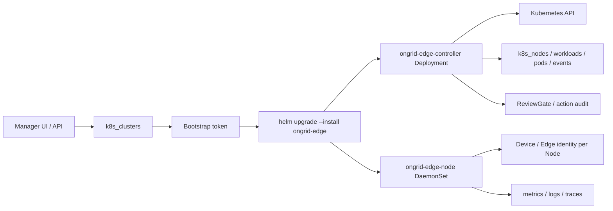

# RFC-001: Kubernetes Full-node 接入适配方案

## 元信息

- 状态：草稿
- 日期：2026-06-29
- 作者：Codex
- 范围：ongrid manager、ongrid-edge、Helm/Kubernetes 部署资产、前端设备与集群视图

## 背景

Ongrid 现有 edge 以主机为中心运行：edge 主动外连 manager/frontier tunnel，首次连接后通过 `register_edge` 同步主机信息，manager 创建或更新 `Device`，后续指标、日志、trace、告警和 AI 工具统一围绕 `device_id` 关联。

Kubernetes 接入不能让所有 Pod 复用同一组 edge 凭证。一个 edge identity 对应一个 tunnel session 和一个 host device，如果 DaemonSet Pod 复用身份，多节点会互相覆盖在线状态、心跳、插件健康和 `device_id` 标签。

因此本方案采用“集群注册 + 节点级 edge identity 自动签发”：manager 创建 Kubernetes 集群和 bootstrap token，Helm 安装后由 controller 和每个 node agent 分别 enroll，换取独立 edge credentials，再复用现有 tunnel、插件和设备链路。

无节点权限接入不在本 RFC 当前交付范围内，后续单独设计。

## 目标

- 一个标准 Kubernetes 集群可以通过 Helm 一次接入 Ongrid。
- 每个 Kubernetes Node 都能作为一个 `Device` 出现在现有 Devices / Monitor / Alerts / AI 工具链路里。
- controller 负责 Kubernetes API watch、资源快照、事件采集和 K8s 写动作。
- node agent 复用现有 edge 主机能力，负责节点主机指标、日志、trace、插件健康和受控诊断。
- K8s 对象查询优先使用 manager DB 当前快照；需要实时细节时通过 controller 访问 Kubernetes API。
- 写动作默认 dry-run / 审批 / 审计，不绕过 ReviewGate。
- 不破坏现有 systemd/binary edge 安装路径。

## 非目标

- 不做跨集群调度、发布系统或自动修复闭环。
- 不接管用户已有 Prometheus Operator、Fluent Bit 或 OTel Operator。
- 不把高 churn 的 Pod/Event 历史长期完整落 MySQL。
- 不在本阶段提供无节点权限集群接入体验。

## 架构



### 组件职责

| 组件 | 代表对象 | 主要数据源 | 动作边界 |
| --- | --- | --- | --- |
| `ongrid-edge-node` | 单个 Node / host Device | 节点 OS、hostPath、进程、节点日志、node_exporter/process_exporter | 节点级诊断能力 |
| `ongrid-edge-controller` | 整个 K8s 集群 | Kubernetes API、Events、kube-state-metrics、应用 metrics | K8s API 写动作 |
| manager | 集群与资源快照 | controller push、DB、Prometheus/Loki/Tempo | 查询、审批、审计、安装命令生成 |

### 数据关系

- `k8s_clusters` 保存集群注册、接入模式、controller edge、token 过期时间、最近同步水位和 watch lag。
- `k8s_nodes` 保存当前 Node 快照，并通过 `edge_id` / `device_id` 关联节点 edge。
- `k8s_workloads`、`k8s_pods` 保存当前资源快照，用于列表、详情、AI 快照查询和排障入口。
- `k8s_events` 保存短期事件窗口，用于异常队列和 AI 诊断。
- `k8s_installations` 保存 Helm 安装实例元数据，full-node 安装按 cluster scope 记录。

## 接入流程

1. 用户在 `/kubernetes` 创建集群，manager 生成集群记录和 bootstrap token。
2. UI 根据当前 manager 访问地址生成远程 Helm 命令，chart 地址使用 `/edge/k8s/ongrid-edge.tgz`。
3. 用户在目标集群执行 Helm 命令，传入：
   - `manager.publicURL`
   - `manager.tunnelAddr`
   - `manager.tlsInsecure`
   - `enrollment.clusterID`
   - `enrollment.controllerBootstrapToken`
   - `enrollment.nodeBootstrapToken`
   - `mode=full-node`
4. controller Deployment 启动后 enroll，作为集群控制面身份连接 tunnel。
5. node DaemonSet 在每个 Node 上启动，每个 Pod 先用 Node Name enroll，换取独立 edge credentials；controller 快照到达后再合并 Kubernetes Node UID。
   - 节点凭据以 `0600` 文件保存在该节点宿主机 `/var/tmp`，Pod 滚动重建时复用，不使用所有节点共享的 Kubernetes Secret。
   - controller bootstrap token 仍按过期时间且只能领取一次；node bootstrap token 在管理员轮换 token 或删除集群前持续有效，以支持后续新增节点自动接入。
6. manager 将 Node edge 关联为普通设备，并在设备列表展示 `K8s Node`、所属集群和可选 `K8s Controller` 标签。

## 数据同步

- controller 默认开启 inventory watch。
- 首次启动使用 full list seed 当前快照。
- watch 事件触发 delta payload，只更新 upsert/delete 的对象。
- 普通周期快照用于兜底收敛。
- full sync 按集群范围清理本轮未出现的 Pod / Workload / Event。
- delta sync 只应用显式 upsert/delete，不做范围 prune。
- manager 记录 `inventory_resource_version`、`inventory_resource_versions_json`、`inventory_synced_at`、`inventory_sync_duration_ms`、`inventory_watch_lag_seconds`。

### Event 保留策略

Kubernetes Event 是高 churn 数据，只保留短期诊断窗口：

- controller 上报当前 Event 快照。
- manager 每轮同步清理当前集群已消失的 Event。
- 后端提供 Event TTL 与每集群上限清理，避免 `k8s_events` 长期膨胀。
- UI 异常队列只展示当前仍有意义的 Warning/异常资源，已恢复信号不再作为健康问题展示。

## AIOps 能力

### 只读查询

- `query_k8s_snapshot`：查询 manager DB 当前快照，支持 clusters / nodes / workloads / pods / events 和 namespace/kind/phase/reason 筛选。
- `describe_k8s_resource`：通过 controller edge 实时访问 Kubernetes API，支持 Pod/Node/Namespace/Service/Deployment/StatefulSet/DaemonSet/ReplicaSet/Job/CronJob/Event describe。
- `query_k8s_logs`：通过 controller edge 调用 `pods/log` 读取有界日志片段，用于 Loki 不可用或需要实时日志的场景。

### 写动作

`execute_k8s_action` 作为写动作工具暴露，必须经过 ReviewGate：

- `scale`
- `rollout_restart`
- `delete_pod`
- `evict_pod`
- `cordon`
- `uncordon`
- `drain`

所有动作需要展示 dry-run、审批状态、执行记录和失败原因。`drain` 默认跳过 DaemonSet、mirror/static、terminal、unmanaged 和 `emptyDir` Pod，并支持 PDB 429 重试与超时参数。

## 前端体验

### 集群列表

- 展示集群名称、模式、状态、controller edge、最近同步、token 到期。
- 提供接入命令、轮换 token、卸载命令和删除入口。
- 删除集群前提示先执行卸载命令；删除只移除 manager 侧记录和该集群关联设备/拓扑数据，不负责远端 Helm 卸载。

### 集群详情

页面定位为 AIOps-oriented K8s Cluster Detail，不做完整 K8s 控制台：

- 顶部展示健康结论、Controller、资源规模、同步状态、快照版本。
- 异常线索按影响面排序，展示异常 Workload、Pod、Node、Warning Event 和同步风险。
- 资源页签包括 Nodes / Workloads / Pods / Events / Namespaces / Actions。
- Telemetry 入口展示 Prometheus / Loki / Tempo 是否可查询，并提供“打开图表”入口，查询语句作为详情信息而非主视觉。
- 写动作独立区域展示 dry-run、审批、建议数和执行记录。
- 拓扑作为辅助入口，不在详情页内强塞大图。

### 设备与拓扑

- 设备列表只展示实际 host/node edge，不单独展示 controller edge。
- K8s Node 设备显示短标签：`K8s Node`、所属集群、可选 `K8s Controller`。
- 删除集群时级联清理该集群关联的节点设备关系和拓扑节点/关系，避免删除主对象后拓扑残留。

## 安装与卸载

安装命令示例：

```bash
helm upgrade --install ongrid-edge 'https://<manager>/edge/k8s/ongrid-edge.tgz' \
  --insecure-skip-tls-verify \
  --namespace ongrid-system \
  --create-namespace \
  --set namespace.create=false \
  --set-string manager.publicURL='https://<manager>' \
  --set-string manager.tunnelAddr='<manager>:40012' \
  --set-string manager.tlsInsecure=true \
  --set-string enrollment.clusterID='<cluster_id>' \
  --set-string enrollment.controllerBootstrapToken='<controller_bootstrap_token>' \
  --set-string enrollment.nodeBootstrapToken='<node_bootstrap_token>' \
  --set-string mode='full-node'
```

卸载命令：

```bash
helm uninstall ongrid-edge --namespace ongrid-system
kubectl delete namespace ongrid-system --ignore-not-found
```

## 验证清单

- Helm chart 渲染包含 controller Deployment、node DaemonSet、ServiceAccount、ClusterRole、ClusterRoleBinding、Controller Secret/ConfigMap；Node 不具备 Secret 读写权限。
- controller ServiceAccount 可 list/watch Nodes/Workloads/Pods/Events，并可执行受支持的 K8s 写动作。
- 每个 Node 都能 enroll 为独立 edge，设备列表自动出现 Node 设备。
- 新增 Node 后 DaemonSet 自动启动并 enroll，新设备自动上报，不依赖一次性快照。
- 删除 Node 后 inventory delta 能清理 `k8s_nodes` 中的旧节点。
- 删除集群时清理关联设备关系和拓扑数据。
- 卸载 Helm 后集群在 90 秒左右进入离线判定。
- Event 表按 TTL 和上限清理，避免长期膨胀。
- `query_k8s_snapshot`、`describe_k8s_resource`、`query_k8s_logs` 能覆盖常见异常定位路径。
- 写动作必须进入 ReviewGate，审批和执行记录可查。

## 风险与缓解

| 风险 | 影响 | 缓解 |
| --- | --- | --- |
| DaemonSet 复用同一 edge 凭证 | 多节点互相覆盖在线状态和 `device_id` | 使用 bootstrap token 换取 per-node edge credentials |
| Node Pod 读取共享凭据 Secret | 单节点失陷后可读取或覆盖其他节点密钥 | 每个节点只在宿主机本地持久化自己的 `0600` 凭据文件，并禁用 Node Pod 的 ServiceAccount token 自动挂载 |
| 离线镜像架构不匹配 | arm64 节点无法启动当前内置镜像 | 当前 Chart 显式调度到 `kubernetes.io/arch=amd64`；支持 arm64 前需增加对应离线镜像包 |
| 可选 kube-state-metrics 访问公网 | 离线环境启用后出现 ImagePullBackOff | 默认关闭；启用时必须显式提供集群可达的离线镜像仓库地址 |
| Event 高 churn | MySQL 表膨胀 | 当前快照 prune + TTL + per-cluster cap |
| controller edge 被当成设备 | 设备列表出现非主机对象 | controller 不创建 host Device，UI 不单独展示 controller edge |
| 未卸载直接删除集群 | 远端仍继续上报 | UI 提示卸载命令，删除后 token/cluster 记录失效，上报应被拒绝或无法关联 |
| 自签名证书 | 目标集群无法拉 chart 或连 manager | 安装命令默认提供 Helm `--insecure-skip-tls-verify` 和 `manager.tlsInsecure=true` |
