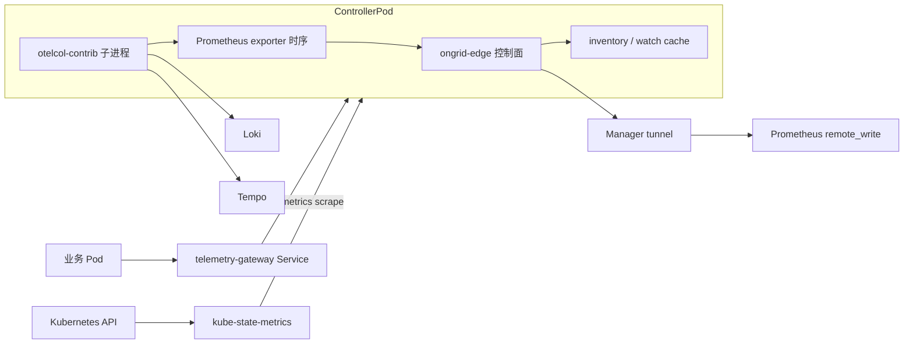
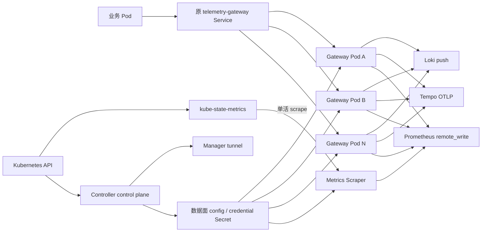

# RFC-002：Kubernetes Controller 遥测数据面拆分与弹性扩容

## 元信息

- 状态：实施中
- 作者：Codex
- 日期：2026-07-22
- 计划评审期：2026-07-23 至 2026-07-27
- 建议实施期：2026-07-28 至 2026-08-26（含 7 天灰度观察）
- 关联 RFC：[RFC-001：Kubernetes Full-node 接入适配方案](./RFC-001-kubernetes-edge-adaptation.md)
- 关联 ADR：[ADR-029：拆分 Kubernetes Controller 与遥测数据面](../adr/ADR-029-kubernetes-telemetry-data-plane-separation.md)（已接受）

## 摘要

当前 `ongrid-edge-controller` 同时承担 Kubernetes 控制面和集群遥测数据面：

- watch Kubernetes 资源、维护 inventory cache、上传快照；
- 接收 K8s 写动作并通过唯一 controller tunnel 执行；
- 在同一容器 cgroup 内启动 `otelcol-contrib` 子进程；
- 接收全部 OTLP traces、logs、metrics；
- 将 OTLP metrics 暂存在 Collector 的 Prometheus exporter，再由 Controller 抓取并经 tunnel 推送。
- 定时抓取 kube-state-metrics（KSM）并把资源状态指标经 controller tunnel 推送。

Chart 将 Controller 限制为单副本、`Recreate` 更新，默认内存上限只有 `512Mi`。当遥测吞吐或时序基数增长时，Collector 的 batch、重试队列、Kubernetes metadata cache 和 Prometheus exporter 时序共同占用内存；一旦同 Pod OOM，inventory、K8s 查询和写动作也同时中断。

本 RFC 建议把遥测数据面拆成两个独立工作负载：多副本 `ongrid-edge-telemetry-gateway` 只承接业务 Pod 的 OTLP 流量；单活 `ongrid-edge-metrics-scraper` 专门抓取 KSM 并直接 remote_write。Controller 保持控制面单写语义，不再接收、抓取或转发任何 logs、traces、OTLP metrics、KSM metrics。业务 Pod 继续使用原 Service DNS，不需要修改 OTLP endpoint。

## 背景与当前链路

### 当前约束

| 现状 | 代码或部署位置 | 影响 |
| --- | --- | --- |
| Controller 只允许一个副本 | `deploy/kubernetes/ongrid-edge/templates/deployment.yaml` | `controller.replicas != 1` 时 Helm 直接失败 |
| Controller 使用 `Recreate` | 同上 | 升级期间没有可用副本 |
| Controller 容器内存上限默认 `512Mi` | `deploy/kubernetes/ongrid-edge/values.yaml` | Go Controller 与 Collector 子进程共享同一个 cgroup 上限 |
| Controller 进程启动 `otelcol-contrib` 子进程 | `cmd/ongrid-edge/main.go`、`internal/edgeagent/plugins/subprocess.go` | Collector OOM 会导致整个 Controller Pod 被 OOMKill |
| 三种 OTLP signal 共用一个 Collector | `internal/edgeagent/plugins/traces/render.go` | 任一 signal 突发都可能挤压其余 signal 和控制面内存 |
| 没有 `memory_limiter` processor | 同上 | Collector 在 Kubernetes OOMKill 前没有软拒绝和主动 GC 水位 |
| batch 最大 16384、trace exporter queue 为 1024 | 同上 | 下游变慢时可在内存中累积大量 payload |
| OTLP metrics 先进入 Prometheus exporter | 同上 | 高基数时序常驻 Collector 内存 |
| Controller 再抓取 `127.0.0.1:9464/metrics` | `cmd/ongrid-edge/main.go`、`internal/edgeagent/k8s/metrics.go` | metrics 同时经过 Collector 时序缓存、文本编码、Go 解析、JSON batch 和 tunnel |
| Controller 默认抓取 KSM Service | `deploy/kubernetes/ongrid-edge/templates/_helpers.tpl`、`internal/edgeagent/k8s/metrics.go` | KSM 指标仍进入 Controller 进程并占用 tunnel 带宽；大 scrape 会与 inventory、查询和写动作争用资源 |
| KSM 与 Controller 分别 watch Kubernetes API | `deploy/kubernetes/ongrid-edge/templates/kube-state-metrics.yaml`、`internal/edgeagent/k8s/inventory.go` | 两者用途不同：KSM 生成状态指标，Controller 维护 inventory；拆分数据路径不消除 KSM 自身的 watch 和内存基线 |
| inventory 保留完整快照和对象 cache | `internal/edgeagent/k8s/inventory.go`、`inventory_delta.go` | 大集群控制面本身已有与对象数量成正比的内存基线 |

### 当前数据流



### 为什么不能直接增加 Controller 副本

直接把现有 Deployment 改为多个副本不能安全解决问题：

1. 所有副本会读取同一个 controller credential，建立相同 edge 身份的 tunnel session，可能互相顶替；
2. 每个副本都会 list/watch 相同 Kubernetes 资源并上传重复 inventory；
3. Controller RPC 和 K8s 写动作缺少 leader election，存在重复执行风险；
4. 每个副本都会保留完整 inventory 和 `k8sattributes` cache，固定内存随副本数线性放大；
5. 每个副本还会抓取同一个 KSM endpoint，造成重复采集和重复写入；
6. 即使增加副本，logs、traces、metrics 仍共享同一 Collector 故障域，无法按 signal 独立限制。

## 目标

- 遥测流量增加时不再挤占 Controller 控制面内存。
- Controller 不再抓取 KSM，也不再通过 tunnel 传输任何 Kubernetes metrics。
- Telemetry Gateway 可以独立设置固定副本或 HPA，最少保持两个可用副本。
- KSM 由独立 Metrics Scraper 单活抓取并直接 remote_write，避免多 Gateway 副本重复采集。
- logs、traces、metrics 都有明确的内存上限、批大小、队列和拒绝指标。
- 下游 Loki、Tempo、Prometheus 变慢或短暂不可用时，Gateway 保持有界，不因无限重试而 OOM。
- 保持现有 Service DNS 和 OTLP 4317/4318 端口，业务 Pod 无需修改配置。
- 保持 `cluster_id`、`ongrid_source` 和 Kubernetes metadata 等现有查询标签。
- Gateway 和 KSM scrape 均有独立开关，可分别退回当前 embedded/controller 模式。
- 容量方案保留至少 30% headroom，并通过可重复压测确定单副本拐点。

## 非目标

- 本 RFC 第一阶段不实现 Controller 控制面的多副本 active-active。
- 本 RFC 第一阶段不实现 KSM 或 Metrics Scraper 的多副本 active-active；超大集群的 KSM 分片和 scrape target 分片作为后续阶段。
- 不承诺下游无限期不可用时零数据丢失。
- 不替代客户已有的 OpenTelemetry Operator 或全局 Collector 平台。
- 不在本 RFC 中重写 inventory watch/cache；拆分后再单独评估大集群对象缓存。
- 不用简单提高内存上限掩盖没有背压的问题。

## 方案

### 1. 拆分控制面和数据面

新增独立的 `ongrid-edge-telemetry-gateway` 和 `ongrid-edge-metrics-scraper` Deployment：



职责边界：

| 组件 | 保留职责 | 移除职责 |
| --- | --- | --- |
| Controller | enroll、controller tunnel、inventory list/watch、只读查询、审批后的 K8s 写动作、数据面配置发布 | OTLP receiver、KSM scrape、logs/traces/metrics 数据转发 |
| Telemetry Gateway | OTLP gRPC/HTTP receiver、K8s metadata enrichment、batch、queue、retry、向观测后端导出 | KSM scrape、inventory、K8s 写动作、controller tunnel、主机能力 |
| Metrics Scraper | 单活抓取 KSM、标签规范化、限流、batch、直接 remote_write | OTLP receiver、inventory、K8s 写动作、controller tunnel |
| kube-state-metrics | 只读 list/watch Kubernetes 资源并暴露状态指标 | remote_write、Controller inventory、Ongrid action |
| Node Edge | 现有节点主机采集与诊断 | 不承担集群集中式 Gateway 的控制职责 |

Controller 保持 `replicas: 1`，但遥测吞吐和 KSM scrape 大小不再影响它。控制面 HA 作为后续独立阶段，通过 Kubernetes Lease leader election 实现，不与数据面扩容绑定。

### 2. Gateway 运行形态

复用当前 `ongrid-edge` 多架构镜像中已经打包的 `otelcol-contrib`，新增轻量的 `k8s-telemetry-gateway` 运行模式：

- 不 enroll 为 controller，不建立 tunnel，不注册 K8s 写动作；
- 从只读挂载的 Gateway Secret 加载数据面凭据和 Manager 下发的 endpoint；
- 渲染 Collector 配置并监督子进程；
- Secret 内容变化时有序重启 Collector，沿用当前插件 Supervisor 的配置收敛模型；
- 对外暴露 OTLP 4317、4318 和独立的健康/指标端口。

Gateway Pod 使用与 Controller 不同的 ServiceAccount。它不拥有 Kubernetes 写权限，只允许 `get/list/watch pods/namespaces/nodes` 供 `k8sattributes` enrichment 使用；如果后续证明 cluster-wide metadata cache 仍然过大，可增加只依赖应用主动上报 resource attributes 的低内存模式。

### 3. Metrics Scraper 运行形态

新增 `k8s-metrics-scraper` 运行模式，复用当前增量 Prometheus 文本解析、标签清理、sample limit 和按样本数/字节数分批逻辑，但把最终出口从 `push_prom_samples` tunnel RPC 改为 Prometheus remote_write：

- 单独部署为 `ongrid-edge-metrics-scraper`，第一阶段固定 `replicas: 1`；
- 不 enroll 为 controller、不建立 tunnel、不启动 inventory、不注册 K8s 查询或写动作；
- 通过固定 KSM Service DNS 抓取 `/metrics`，不需要访问 Kubernetes API；
- 使用专用只写凭据直接写入当前启用的 Prometheus-compatible backend；
- 强制写入 `cluster_id` 和 `ongrid_source="k8s:kube-state-metrics"`，并禁止目标端覆盖这些系统标签；
- 保留当前高基数标签清理规则、`250000` sample limit、`10000` samples/批和 `4MiB`/批的默认边界，最终值由压测校准；
- 使用 `Recreate` 或等价的无重叠更新策略，保证任一时刻只有一个 scraper 抓同一 KSM endpoint。

不能简单让所有 Telemetry Gateway 副本启用相同的 Prometheus receiver。Gateway 是多副本 Deployment，所有副本抓同一 KSM 会产生重复样本；第一阶段使用独立单活 Scraper，把可用性取舍限定为最多丢失若干个 scrape interval，而不是污染时序。后续如需高可用，必须引入明确的 Lease leader election、target allocator 或 KSM/scrape target 分片后再增加副本。

KSM 本身继续使用独立 ServiceAccount 对 Kubernetes API 执行只读 `get/list/watch`。KSM 的对象 cache 和内存上限属于独立故障域；KSM OOM 会造成状态指标缺口，但不会拖垮 Controller、inventory 或 K8s action。

### 4. 使用独立的数据面凭据

不能让所有 Gateway 副本复用具备控制面能力的 controller credential。

Manager 在 controller enroll 成功时额外签发 cluster-scoped 数据面 credential：

- scope 固定为 `telemetry_ingest`；
- 允许通过 nginx `auth_request` 写入 logs、traces、metrics；
- 禁止建立 tunnel、调用工具或执行 K8s action；
- 删除集群时同步失效；数据面凭据可独立轮换，不依赖 controller token；
- 多个 Gateway 副本共享这一组数据面凭据，便于按集群限流与吊销。

Controller 将凭据和已解析的 telemetry endpoint 写入专用 Kubernetes Secret。Gateway 只挂载 OTLP 数据面需要的字段；Metrics Scraper 只挂载 Prometheus remote_write endpoint 和写凭据，不获得 Loki、Tempo 或查询权限。状态和日志只记录 Secret 名称、版本与校验和，不记录密码。

Controller 启动时及之后按 `telemetryConfig.refreshInterval`（默认 `1m`）用现有 telemetry access/secret 向 Manager 证明凭据仍有效：验证成功只刷新 endpoint、TLS 和 backend 写凭据，不轮换 live credential；Secret 缺失或证明失效时才签发新凭据。同步失败时保留 Secret 上一版并继续控制面，下一周期重试。这样既能动态传播第三方 backend 配置，也避免 Controller 重启后 Manager 立即使旧凭据失效、而 Gateway 尚未看到 Secret 投影更新所造成的短暂 401。Manager 仍只持久化 telemetry secret 的密码哈希。

### 5. 四条遥测链路的目标数据流

#### Traces

```text
Pod -> Gateway OTLP -> memory_limiter -> k8sattributes
    -> resource/cluster -> batch/traces -> bounded queue -> Manager /v1/traces -> Tempo
```

继续使用现有 `/v1/traces` 数据面鉴权和 Tempo 路径。

#### Logs

```text
Pod -> Gateway OTLP -> memory_limiter -> k8sattributes
    -> resource/loki_labels -> batch/logs -> bounded queue
    -> Manager /loki/api/v1/push -> Loki
```

继续使用现有 Loki push 数据面路径，并强制覆盖 `cluster_id` 和 `ongrid_source`，防止客户端伪造系统标签。

#### OTLP Metrics

```text
Pod -> Gateway OTLP -> memory_limiter -> k8sattributes
    -> resource/cluster -> transform/system_labels -> batch/metrics
    -> prometheusremotewrite -> active Prometheus-compatible backend
```

OTLP Metrics 不再经过以下旧链路：

```text
Prometheus exporter -> localhost:9464 text scrape -> Go parse
-> JSON tunnel batch -> Manager decode -> remote_write encode
```

#### kube-state-metrics

```text
Kubernetes API -> kube-state-metrics -> Metrics Scraper
    -> streaming parse -> label drop/system labels -> bounded batch
    -> remote_write -> active Prometheus-compatible backend
```

KSM Metrics 不再经过以下旧链路：

```text
kube-state-metrics -> Controller Go scrape -> JSON tunnel batch
-> Manager decode -> remote_write encode
```

KSM 不是 OTLP signal，不经过多副本 Telemetry Gateway。Metrics Scraper 必须保持现有查询兼容性：强制 `cluster_id` 和 `ongrid_source="k8s:kube-state-metrics"`，保留业务指标名与非高基数标签，并继续上报 `up`、`ongrid_scrape_partial`、`ongrid_scrape_samples_accepted` 等抓取状态指标。

内置 Prometheus 增加只接受 telemetry credential 的精确 remote_write 写入口；外部 Prometheus 模式由 Manager 将当前已解析的 remote_write endpoint 和必要凭据分别发布到 Gateway 与 Metrics Scraper Secret。不得把 Prometheus 查询权限一并下放给数据面 Pod。

### 6. 内存、批处理与背压

Collector 的每条 pipeline 第一项都必须是 `memory_limiter`。第一版建议默认值：

| 配置 | 建议默认值 | 说明 |
| --- | --- | --- |
| Gateway container limit | `1Gi` | 与 Controller 完全隔离 |
| `memory_limiter.limit_mib` | `768` | 给 Collector runtime、wrapper 和瞬时分配保留约 25% |
| `memory_limiter.spike_limit_mib` | `128` | 提前触发拒绝和 GC |
| `check_interval` | `1s` | 快于常见突发持续时间 |
| batch timeout | `1s` | 避免低流量时长时间占用内存 |
| batch max size | 每个 signal 独立配置，默认不超过 `4096` | 不再三种 signal 共用一个大 batch |
| sending queue | 每个 exporter 独立、有界 | 队列满时暴露拒绝/丢弃指标，不无限增长 |
| retry max elapsed | 默认 `5m` | 下游长期故障时停止无限占用资源 |

Metrics Scraper 使用独立资源边界：

| 配置 | 建议默认值 | 说明 |
| --- | --- | --- |
| Scraper container limit | `512Mi` | 与 Controller、Gateway、KSM 分别隔离 |
| scrape sample limit | `250000` | 超限立即停止继续解析并上报 partial，不尝试把整个响应保存在内存 |
| batch sample limit | `10000` | 沿用当前增量分批边界 |
| batch byte limit | `4MiB` | 防止单次 remote_write payload 过大 |
| scrape interval / timeout | `30s` / `15s` | scrape 不允许跨越下一周期累积 |
| remote_write retry | 最多 `3` 次，单批总超时 `30s` | 有界重试；不能因后端长期不可用无限保留样本 |

Scraper 必须逐行/增量解析 KSM exposition，不允许先构造完整 `[]PromSample`。KSM Pod 继续拥有独立的 CPU/内存 request 与 limit；压测必须同时观察 KSM cache 和 Scraper RSS，不能只验证 remote_write 成功。

第一阶段只实现有界内存 queue。可选的 `file_storage` persistent queue 作为后续增强，启用前必须满足：

- 使用带 `sizeLimit` 的 `emptyDir`，默认关闭；
- 开启后将短期下游故障的队列从 heap 转移到本地临时磁盘；
- Pod 被驱逐或节点丢失时仍可能丢失，不能宣称 durable；
- 磁盘队列满时必须拒绝新数据并告警，不能挤满节点根盘。

所有默认值必须经过压测校准。Helm 模板应校验 `memory_limiter.limit_mib` 明显低于 container memory limit，避免错误配置使 limiter 晚于 cgroup OOM 生效。

### 7. 横向扩容与可用性

新增 Helm values：

```yaml
telemetryConfig:
  refreshInterval: 1m

telemetryGateway:
  mode: deployment       # embedded | deployment
  replicas: 2
  autoscaling:
    enabled: false
    minReplicas: 2
    maxReplicas: 10
    targetCPUUtilizationPercentage: 60
    # 使用 AverageValue，而不是相对 memory request 的 Utilization。
    # 默认 600Mi，先于 640Mi soft limit（768Mi - 128Mi spike）扩容。
    targetMemoryAverageValue: 600Mi
    scaleDownStabilizationWindowSeconds: 300
  resources:
    requests:
      cpu: 200m
      memory: 256Mi
    limits:
      cpu: "1"
      memory: 1Gi
  memoryLimiter:
    limitMiB: 768
    spikeLimitMiB: 128
  queueSize: 512

kubernetesMetrics:
  mode: scraper           # controller | scraper
  enabled: true           # 切换时先设 false 停止两条路径
  replicas: 1             # 第一阶段必须为 1，Helm 对其他值直接失败
  resources:
    requests:
      cpu: 100m
      memory: 128Mi
    limits:
      cpu: 500m
      memory: 512Mi
```

部署约束：

- 默认固定两个副本；确认集群安装了 metrics-server 后再启用 HPA；
- HPA 最小副本数不得小于 2；
- 内存 HPA 使用明确的 `averageValue`，不能把 limit 百分比误写成 request 利用率；
- `PodDisruptionBudget.minAvailable: 1`；
- 使用 `topologySpreadConstraints`，尽量分散到不同 Node/zone；
- `RollingUpdate.maxUnavailable: 0`、`maxSurge: 1`；
- readiness 必须同时检查 Collector receiver 和配置已加载；
- Service 只选择 Ready Gateway Pod。

Metrics Scraper 不跟随 Telemetry Gateway HPA 扩容。第一阶段 Helm 必须校验 `kubernetesMetrics.replicas == 1`，更新时不得同时运行两个会抓同一 KSM endpoint 的 Pod。若单 Scraper 达到容量拐点，应先减少无用 KSM collectors/labels，再设计 KSM shard 与 scrape target shard；不得通过无分片加副本解决。

Kubernetes Service 按连接分发。OTLP gRPC 是长连接，单条高吞吐连接不会在扩容后自动拆分到多个 Pod；容量验证必须包含长连接热点场景。若真实流量由少量超大客户端构成，优先让客户端使用多个 exporter 实例或 OTLP HTTP，必要时再引入支持连接级再均衡的前置代理。

### 8. 容量模型

不使用“每 N 个 Pod 固定一个 Gateway”的静态猜测。先测量单副本拐点，再计算副本数：

```text
required_replicas = ceil(
  max(
    peak_spans_per_second / tested_spans_per_second,
    peak_log_bytes_per_second / tested_log_bytes_per_second,
    peak_metric_points_per_second / tested_metric_points_per_second
  ) * 1.3
)
```

其中单副本可用吞吐必须同时满足：

- container memory P99 不超过 limit 的 70%；
- CPU P99 不超过 request 的 70% 或已知 HPA target；
- receiver refused 和 exporter send failed 在稳定负载下为 0；
- export P99 latency 满足约定 SLO；
- 下游短暂抖动不会造成持续队列增长。

压测至少覆盖：

1. 30 分钟稳定峰值；
2. 5 分钟 2 倍突发；
3. Loki、Tempo、Prometheus 分别中断 5 分钟；
4. 同时中断三个下游 5 分钟；
5. 删除一个 Gateway Pod；
6. HPA 从 2 扩到最大副本并回落；
7. 少量 OTLP gRPC 长连接产生热点；
8. 高基数 metrics 和大日志行/大 trace payload。

KSM/Scraper 使用独立容量门槛，不计入 OTLP Gateway 副本公式：

- KSM 暴露的样本数不超过已验证的 sample limit，预估增长保留至少 30% headroom；
- 单次 scrape P99 耗时不超过 interval 的 50%；
- KSM 和 Scraper container memory P99 均不超过各自 limit 的 70%；
- Scraper 最大 batch 不超过样本数和字节数双重边界；
- 达到边界时必须产生 partial/limit 告警，不允许静默截断；
- 超出单 Scraper 拐点时，以 KSM shard 数和 scrape target shard 数重新建模，不复用 OTLP HPA 公式。

### 9. 可观测性和告警

Gateway 必须暴露 Collector 自身指标，并由现有监控链路采集：

- receiver accepted/refused spans、log records、metric points；
- exporter sent/send failed；
- exporter queue size/capacity；
- process RSS、heap、CPU、GC；
- Pod restart、OOMKilled、HPA desired/current replicas；
- 每个 signal 的 batch size 和 export latency；
- 配置版本、最后成功 reload 时间。

Metrics Scraper 必须暴露：

- KSM scrape `up`、duration、observed/accepted samples、partial 和 sample-limit exceeded；
- remote_write 成功/失败 batch、成功/拒绝 samples、重试次数和最后成功时间；
- process RSS、heap、CPU、GC 和 Pod restart/OOMKilled；
- 当前 `cluster_id`、配置版本和最后成功 reload 时间；`cluster_id` 允许作为低基数 label，endpoint、错误文本和 Secret 信息禁止作为 label。

新增至少以下告警并附 Runbook：

| 告警 | 建议条件 |
| --- | --- |
| `K8sTelemetryGatewayMemoryHigh` | 10 分钟内存持续超过 limit 的 75% |
| `K8sTelemetryGatewayRefusingData` | 任一 receiver refused 持续大于 0 |
| `K8sTelemetryGatewayQueueNearFull` | queue 使用率持续超过 80% |
| `K8sTelemetryGatewayExportFailure` | send failed 连续增长 5 分钟 |
| `K8sTelemetryGatewayReplicaUnavailable` | available replicas 小于 2 |
| `K8sTelemetryGatewayOOMKilled` | 任一 Gateway container OOMKilled |
| `K8sMetricsScraperDown` | 连续两个 scrape interval 未成功抓取或写入 KSM metrics |
| `K8sMetricsScrapePartial` | `ongrid_scrape_partial` 连续两个周期为 1 |
| `K8sMetricsSampleLimitNearCapacity` | accepted samples 持续超过 sample limit 的 70% |
| `K8sMetricsScraperMemoryHigh` | 10 分钟内存持续超过 limit 的 75% |
| `K8sControllerInventoryLag` | 拆分后 watch lag 超过现有基线或 30 秒 |

## 兼容与迁移

### Feature flag

`telemetryGateway.mode` 支持：

- `embedded`：保持当前 Controller 内嵌 Collector，作为回滚路径；
- `deployment`：启用独立 Gateway Deployment，Controller 不启动 Collector。

`kubernetesMetrics.mode` 独立支持：

- `controller`：保持当前 Controller 抓 KSM 并经 tunnel 推送，作为回滚路径；
- `scraper`：启用独立 Metrics Scraper，Controller 不再读取 KSM endpoint，也不再发送来源为 `k8s:kube-state-metrics` 的 `push_prom_samples`。

`kubernetesMetrics.enabled=false` 是无重叠切换闸门：此时 Controller 不读取 KSM endpoint，独立 Metrics Scraper 也不会创建。它只用于切换窗口，正常运行应设为 `true`。

第一轮发布保持 `telemetryGateway.mode=embedded`、`kubernetesMetrics.mode=controller`，通过预发和少量集群显式启用新模式。完成压测和至少 7 天 soak 后，新安装默认改为 `deployment` + `scraper`；升级安装继续保留用户已设置的值。两个开关独立，便于分别灰度和回滚。

### 无感迁移

- 保留现有 `ongrid-edge-telemetry-gateway.<namespace>.svc:4317/4318`；
- 只修改 Service selector，不要求业务 Pod 改 endpoint；
- 新 Gateway Ready 后再让 Service 切流；
- Controller 的 embedded Collector 在 Service 完成切流后停止；
- 切换期间允许短暂重连，但不能同时把同一批数据广播到两套 Gateway。

KSM 迁移使用“先停旧抓取，再启新抓取”的无重叠顺序。不能在一次 Helm release 中直接从 `controller` 切到 `scraper`：Kubernetes 不保证旧 Controller 与新 Scraper 的调和顺序。

1. 先以兼容模式升级新版本，保持 `kubernetesMetrics.mode=controller`、`kubernetesMetrics.enabled=true`，确认 telemetry Secret 已填充；
2. 执行 `helm upgrade ... --reuse-values --set kubernetesMetrics.mode=controller --set kubernetesMetrics.enabled=false --wait`；
3. 确认新 Controller 已就绪、不再请求 KSM，且 tunnel 不再产生 `k8s:kube-state-metrics` batch；
4. 执行 `helm upgrade ... --reuse-values --set kubernetesMetrics.mode=scraper --set kubernetesMetrics.enabled=true --wait`；
5. 等待 Metrics Scraper 首个完整 scrape 和 remote_write 成功，对比 golden labels、样本数和关键 PromQL；
6. 迁移窗口允许缺失一个 scrape interval，但禁止两条路径同时写同一组时序。

### 回滚

回滚动作：

1. Controller 重新启用 embedded Collector；
2. 等待其 readiness 成功；
3. Service selector 切回 Controller；
4. 缩容独立 Gateway Deployment；
5. 执行 `helm upgrade ... --reuse-values --set kubernetesMetrics.mode=scraper --set kubernetesMetrics.enabled=false --wait`，停止 Metrics Scraper 并确认其不再抓取 KSM；
6. 执行 `helm upgrade ... --reuse-values --set kubernetesMetrics.mode=controller --set kubernetesMetrics.enabled=true --wait`，恢复 Controller KSM scrape，并确认首个 tunnel batch 被 Manager 接受；
7. 保留数据面 Secret，便于再次尝试。

回滚不涉及数据库 schema 回退。新增 telemetry credential 可以保留或显式吊销。

## 备选方案

### 方案 A：只提高 Controller 内存上限

例如把 `512Mi` 提高到 `2Gi`。

不采用为长期方案。它只能推迟 OOM，无法隔离控制面和数据面，也没有解决无界队列、高基数 Prometheus exporter 和单点升级中断。可以作为当前生产事故的临时止血措施。

### 方案 B：现有 Controller 直接增加副本并做 leader election

所有副本运行完整 Controller，只有 leader 执行 inventory 和写动作，所有副本接收 telemetry。

不作为首选。它仍把控制面与 Collector 放在同一故障域，并要求先解决 tunnel identity、credential、leader 切换和非 leader 行为。即使实现，`k8sattributes` 和 inventory cache 仍会在多个副本重复占用内存。后续可单独用于控制面 HA。

### 方案 C：Node-local Telemetry Gateway DaemonSet

每个 Node 运行一个 Gateway，并通过 `internalTrafficPolicy: Local` 接收本节点 Pod 的 telemetry。

不作为第一阶段默认。它能按 Node 自然扩容并缩小 metadata cache，但会在每个 Node 固定占用资源；Node 上没有可用 Gateway 时流量直接失败，且极端热点 Node 仍无法横向拆分。可作为超大集群或严格数据本地化场景的后续模式。

### 方案 D：要求客户安装 OpenTelemetry Operator

完全使用客户自有 Gateway/Collector，Ongrid 只提供 exporter 配置。

保留为高级接入方式，但不能作为默认方案。它把版本、RBAC、升级和故障排查责任转嫁给用户，也不解决开箱即用安装的单 Controller OOM。

### 方案 E：每个 Telemetry Gateway 副本都抓取 KSM

在多副本 Gateway 的 Collector 配置中加入相同 KSM Prometheus scrape target。

不采用。每个副本都会独立抓取同一 endpoint 并写入相同 `cluster_id`/labels，产生重复或乱序样本；Gateway HPA 每次扩缩容还会改变重复倍数。除非先引入 target allocator、leader election 或明确分片，否则 KSM 抓取必须与 OTLP Gateway 副本数解耦。

## 影响范围

### 代码

- `cmd/ongrid-edge`：新增 telemetry gateway 和 KSM metrics scraper 运行模式；
- `internal/edgeagent/plugins/traces`：拆分 signal batch/queue、增加 memory limiter 和 direct remote_write；
- `internal/edgeagent/k8s/remote_write_scraper.go`：复用增量解析和有界 batch，新增不依赖 tunnel/Kubernetes API 的 direct-remote-write 出口；Controller 仅在回滚模式启用旧抓取；
- `internal/manager/biz/k8s`：签发/轮换数据面凭据并生成 Gateway 配置；
- `internal/manager/server/edgeauth`：识别 credential scope；
- `deploy/kubernetes/ongrid-edge`：新增 Gateway 与 Metrics Scraper Deployment、HPA、PDB、Secret、Service selector、互斥迁移逻辑和 values；
- nginx：增加 telemetry-credential-authenticated metrics remote_write 精确写入口；
- CI：增加 Gateway 与 KSM 两组新旧 mode 组合的 Helm render、单活、策略和资源校验。

### 运行时

- 启用目标模式后新增至少两个 Gateway Pod 和一个 Metrics Scraper Pod，集群基础资源开销增加；
- Controller 内存显著下降，并不再随 telemetry 吞吐增长；
- OTLP metrics 和 KSM metrics 均不再经 tunnel，减少 Controller 和 Manager 的重复编码/解码；
- KSM 仍独立 list/watch Kubernetes API；其对象 cache 未被消除，只是与 Controller 故障域隔离；
- 高压时 Gateway 会先拒绝或丢弃有界数据，而不是 OOM 连带控制面。

### 安全

- 新增数据面 credential scope；
- Gateway ServiceAccount 不具备 K8s 写权限；
- Gateway Secret 含 ingest 凭据，必须只挂载到 Gateway；Metrics Scraper 只挂载 remote_write 所需字段；
- Helm 只创建不含 `data` 的 Telemetry Secret，运行时字段由 Controller 持有并更新，禁止用 `lookup` 将 live credential 复制进 Helm release 历史；
- Metrics Scraper 使用固定 KSM Service DNS，不授予 Kubernetes API RBAC，并关闭 ServiceAccount token 自动挂载；KSM 自身继续使用只读 ServiceAccount；
- `manager.tlsInsecure` 只允许作用于同源 Manager 写入口；第三方 remote_write 后端独立遵循其 TLS/CA 配置；
- 外部 backend 凭据如果下发到集群，应使用单独只写账号并支持轮换。

## 风险与缓解

| 风险 | 影响 | 缓解 |
| --- | --- | --- |
| Service 切换时 endpoint 短暂为空 | telemetry 客户端重试或丢少量数据 | 新 Gateway Ready 后切 selector；SDK 配置重试 |
| HPA 依赖 metrics-server | 无法自动扩容 | 默认固定 2 副本；安装前检查后显式启用 HPA |
| OTLP gRPC 长连接热点 | 新副本空闲、旧副本过载 | 压测热点；鼓励多 exporter/OTLP HTTP；必要时前置代理 |
| 每个 Gateway 都有 cluster-wide k8sattributes cache | 固定内存随副本增长 | 只提取必要字段；后续支持无 cache/Node-local 模式 |
| 下游故障导致队列满 | 拒绝或丢数据 | memory limiter、有界内存 queue、明确告警；磁盘 queue 留作后续增强 |
| 两条 KSM 路径迁移时重叠 | 重复或乱序样本 | 先停 Controller scrape、再启 Scraper；Helm 状态互斥；验收 remote_write 前检查旧 tunnel source 已停止 |
| 单活 Metrics Scraper 更新或故障 | 出现若干 scrape interval 的 KSM 指标缺口 | readiness、明确告警、快速重建；第一阶段接受短缺口，HA 必须先引入选主或分片 |
| KSM 或 Scraper 达到单实例容量上限 | partial scrape 或状态指标缺失 | 30% headroom、sample-limit 预警、精简 collectors/labels；超限后实施 KSM 与 target 分片 |
| 数据面凭据被窃取 | 可伪造 telemetry | scope 限制、集群级限流、Secret 最小权限、支持立即吊销 |
| metrics 直写标签与旧链路不一致 | 现有 PromQL/告警失效 | golden payload 测试，强制 `cluster_id`/`ongrid_source`，双路径对比但不同时写生产 TSDB |
| embedded 回滚路径长期腐化 | 事故时无法回退 | CI 每次渲染并启动两种 mode；定期演练回滚 |

## 实施计划

| 里程碑 | 工作项 | 预计时间 | 产物 |
| --- | --- | --- | --- |
| M0 基线 | 补 Collector 自监控；构造三种 OTLP signal 与不同 KSM 对象/样本规模；记录 Controller、KSM、Scraper 单实例拐点 | 2 至 3 天 | `docs/ops/loadtest-<date>.md` |
| M1 故障域拆分 | 新增 Gateway mode、Deployment、Service selector、embedded feature flag | 3 天 | 可独立部署的 Gateway |
| M2a OTLP 数据路径 | 数据面 credential scope；logs/traces 保持路径；OTLP metrics direct remote_write | 2 至 3 天 | 三种 OTLP signal 全链路 |
| M2b KSM 数据路径 | 新增单活 KSM Scraper、direct remote_write、独立 feature flag 和无重叠切换 | 2 至 3 天 | KSM 目标链路 |
| M3 弹性与保护 | memory limiter、独立 batch/queue、HPA、PDB、spread、告警 | 2 天 | 容量保护和 Runbook |
| M4a 验证 | OTLP 压测、KSM 大 scrape、下游故障、Pod kill、KSM 无重叠切换和回滚演练 | 2 至 3 天 | 验收记录 |
| M4b 灰度 | 少量集群启用新模式并连续观察 7 天 | 7 天观察 | 默认值与推广结论 |

所有任务按 1 至 3 天颗粒度拆分。M0 没有拿到基线数据前，不把建议默认值当成最终容量承诺。

## 验收标准

- Helm 的 Gateway `embedded/deployment` 与 KSM `controller/scraper` 组合均能 lint、render、安装和回滚；`kubernetesMetrics.enabled=false` 不渲染 Scraper 且不给 Controller 注入 KSM 配置；非法多副本 Scraper 配置渲染失败。
- `deployment` 模式下 Controller Pod 内不再存在 `otelcol-contrib` 进程，也不监听 4317/4318。
- `scraper` 模式下 Controller 不再请求 KSM endpoint，且 tunnel 中不再出现来源为 `k8s:kube-state-metrics` 的 `push_prom_samples`；Metrics Scraper 不建立 controller tunnel。
- 2 倍目标峰值持续 5 分钟时 Controller 无 OOM、RSS 不随 telemetry 吞吐显著增长。
- Gateway 在稳定峰值下内存 P99 不超过 limit 的 70%，保留至少 30% headroom。
- 稳定峰值下三种 OTLP signal 的 receiver refused、exporter send failed 为 0。
- 目标 KSM 规模下 Scraper 与 KSM 内存 P99 不超过各自 limit 的 70%，单次 scrape P99 不超过 interval 的 50%，稳定负载无 partial/limit exceeded。
- 任一时刻至多一个有效 KSM scraper；切换验证不存在 Controller 与 Scraper 双写或多个 Scraper 重复抓取。
- 任一 Gateway Pod 删除后，Service 仍有可用 endpoint，Controller inventory 和 K8s action 不受影响。
- 删除 Metrics Scraper Pod 时 Controller inventory 和 K8s action 不受影响；Scraper 重建后在两个 scrape interval 内恢复写入并触发/恢复相应告警。
- 任一下游中断 5 分钟时 Gateway 不 OOM；恢复后队列回落，实际丢失量有记录且不超过配置的有界容量。
- HPA 启用时可以从 2 副本扩容并在稳定窗口后回落，scale down 不造成持续 export failure。
- OTLP metrics 与 KSM metrics 新旧链路的 `cluster_id`、`ongrid_source` 和业务标签 golden test 一致，现有 K8s PromQL 和告警无需修改。
- telemetry credential 无法建立 tunnel 或调用 K8s action。
- 日志、状态 API、Pod spec 和进程参数不泄露任何 ingest/backend 密码。
- `inventory_watch_lag_seconds` P99 不高于拆分前基线，目标不超过 30 秒。
- 完成一次 `deployment -> embedded` 和一次 `scraper -> controller` 回滚演练并记录耗时、指标缺口与重复样本检查结果。

## 已确认与待量化事项

已确认：第一阶段同时支持 Manager 内置 Prometheus 和外部 Prometheus-compatible backend 的动态 endpoint/写凭据下发；HPA 默认关闭并固定两个 Gateway 副本；persistent queue 不进入第一阶段；Metrics Scraper 第一阶段单活，切换或故障允许短暂指标缺口。

待通过 M0/M4 量化：峰值 spans/s、log MiB/s、OTLP metric points/s、最大 active series，以及 KSM 最大对象数/样本数。未取得基线与 2 倍峰值压测结果前，不调整新安装默认模式。

## 变更记录

| 日期 | 变更 | 作者 |
| --- | --- | --- |
| 2026-07-22 | 初稿：拆分 Controller 控制面与可横向扩展的 Telemetry Gateway | Codex |
| 2026-07-22 | 补充 KSM 目标链路：独立单活 Metrics Scraper 直接 remote_write，禁止多 Gateway 重复抓取 | Codex |
| 2026-07-22 | 关联 ADR-029，固化 Controller、Gateway 与 Metrics Scraper 的职责边界 | Codex |
| 2026-07-22 | ADR 接受后启动实现；增加独立数据面凭据、部署模板、有界队列，以及 KSM 无重叠迁移闸门 | Codex |
